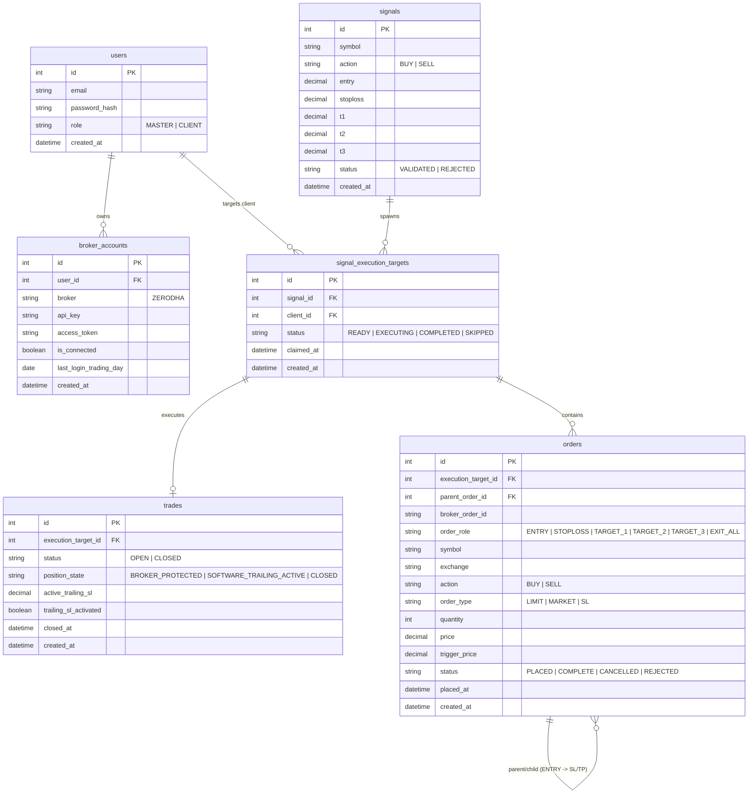

# Database Schema & Entity-Relationship Documentation

This document outlines the database schema, primary tables, fields, and foreign key relationships.

---

## Entity-Relationship (ER) Diagram

---

## Table Schemas & Foreign Key Relationships

### 1. `users`
* **Primary Key**: `id`
* **Fields**: `email`, `password_hash`, `role` (`MASTER` | `CLIENT`), `created_at`
* **Relationships**: Has many `broker_accounts` and `signal_execution_targets`.

### 2. `broker_accounts`
* **Primary Key**: `id`
* **Foreign Keys**: `user_id` $\rightarrow$ `users.id`
* **Fields**: `broker`, `api_key`, `access_token`, `is_connected`, `last_login_trading_day`, `created_at`
* **Relationships**: Belongs to a `users` record.

### 3. `signals`
* **Primary Key**: `id`
* **Fields**: `symbol`, `action` (`BUY` | `SELL`), `entry`, `stoploss`, `t1`, `t2`, `t3`, `status`, `created_at`
* **Relationships**: Spawns multiple `signal_execution_targets`.

### 4. `signal_execution_targets`
* **Primary Key**: `id`
* **Foreign Keys**: 
  * `signal_id` $\rightarrow$ `signals.id`
  * `client_id` $\rightarrow$ `users.id`
* **Fields**: `status` (`READY` | `EXECUTING` | `COMPLETED` | `SKIPPED`), `claimed_at`, `created_at`
* **Relationships**: Links a `signal` to a client `user`. Has one `trade` and many `orders`.

### 5. `trades`
* **Primary Key**: `id`
* **Foreign Keys**: `execution_target_id` $\rightarrow$ `signal_execution_targets.id`
* **Fields**: `status` (`OPEN` | `CLOSED`), `position_state`, `active_trailing_sl`, `trailing_sl_activated`, `closed_at`, `created_at`
* **Relationships**: Maps 1:1 to a `signal_execution_target`.

### 6. `orders`
* **Primary Key**: `id`
* **Foreign Keys**: 
  * `execution_target_id` $\rightarrow$ `signal_execution_targets.id`
  * `parent_order_id` $\rightarrow$ `orders.id` (Self-referential for parent ENTRY order $\rightarrow$ child SL/TP orders)
* **Fields**: `broker_order_id`, `order_role`, `symbol`, `exchange`, `action`, `order_type`, `quantity`, `price`, `trigger_price`, `status`, `placed_at`, `created_at`
* **Relationships**: Belongs to a `signal_execution_target`. Self-referencing hierarchy for child exit orders.
