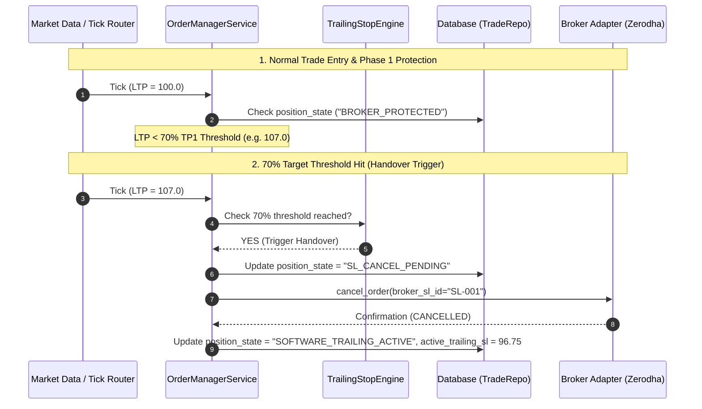
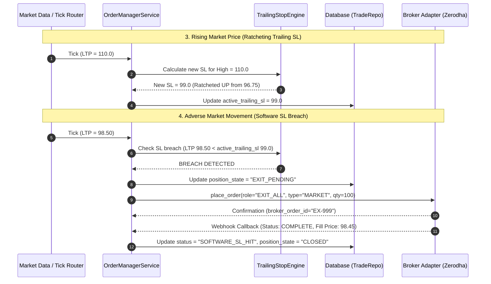
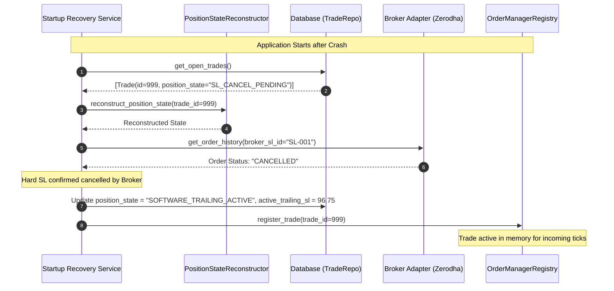

# 8. Sequence Diagrams

## 8.1 Normal Trade & Handover Sequence

```mermaid
sequenceDiagram
    autonumber
    participant MD as Market Data / Tick Router
    participant OM as OrderManagerService
    participant TE as TrailingStopEngine
    participant DB as Database (TradeRepo)
    participant BR as Broker Adapter (Zerodha)

    Note over MD,BR: 1. Normal Trade Entry & Phase 1 Protection
    MD->>OM: Tick (LTP = 100.0)
    OM->>DB: Check position_state ("BROKER_PROTECTED")
    Note over OM: LTP < 70% TP1 Threshold (e.g. 107.0)

    Note over MD,BR: 2. 70% Target Threshold Hit (Handover Trigger)
    MD->>OM: Tick (LTP = 107.0)
    OM->>TE: Check 70% threshold reached?
    TE-->>OM: YES (Trigger Handover)
    OM->>DB: Update position_state = "SL_CANCEL_PENDING"
    OM->>BR: cancel_order(broker_sl_id="SL-001")
    BR-->>OM: Confirmation (CANCELLED)
    OM->>DB: Update position_state = "SOFTWARE_TRAILING_ACTIVE", active_trailing_sl = 96.75
```

---

## 8.2 Software Trailing & Market Breach Exit Sequence

```mermaid
sequenceDiagram
    autonumber
    participant MD as Market Data / Tick Router
    participant OM as OrderManagerService
    participant TE as TrailingStopEngine
    participant DB as Database (TradeRepo)
    participant BR as Broker Adapter (Zerodha)

    Note over MD,BR: 3. Rising Market Price (Ratcheting Trailing SL)
    MD->>OM: Tick (LTP = 110.0)
    OM->>TE: Calculate new SL for High = 110.0
    TE-->>OM: New SL = 99.0 (Ratcheted UP from 96.75)
    OM->>DB: Update active_trailing_sl = 99.0

    Note over MD,BR: 4. Adverse Market Movement (Software SL Breach)
    MD->>OM: Tick (LTP = 98.50)
    OM->>TE: Check SL breach (LTP 98.50 < active_trailing_sl 99.0)
    TE-->>OM: BREACH DETECTED
    OM->>DB: Update position_state = "EXIT_PENDING"
    OM->>BR: place_order(role="EXIT_ALL", type="MARKET", qty=100)
    BR-->>OM: Confirmation (broker_order_id="EX-999")
    BR-->>OM: Webhook Callback (Status: COMPLETE, Fill Price: 98.45)
    OM->>DB: Update status = "SOFTWARE_SL_HIT", position_state = "CLOSED"
```

---

## 8.3 Startup Recovery & Crash Reconcile Sequence

```mermaid
sequenceDiagram
    autonumber
    participant APP as Startup Recovery Service
    participant REC as PositionStateReconstructor
    participant DB as Database (TradeRepo)
    participant BR as Broker Adapter (Zerodha)
    participant REG as OrderManagerRegistry

    Note over APP,REG: Application Starts after Crash
    APP->>DB: get_open_trades()
    DB-->>APP: [Trade(id=999, position_state="SL_CANCEL_PENDING")]
    APP->>REC: reconstruct_position_state(trade_id=999)
    REC-->>APP: Reconstructed State
    APP->>BR: get_order_history(broker_sl_id="SL-001")
    BR-->>APP: Order Status: "CANCELLED"
    Note over APP: Hard SL confirmed cancelled by Broker
    APP->>DB: Update position_state = "SOFTWARE_TRAILING_ACTIVE", active_trailing_sl = 96.75
    APP->>REG: register_trade(trade_id=999)
    Note over REG: Trade active in memory for incoming ticks
```
