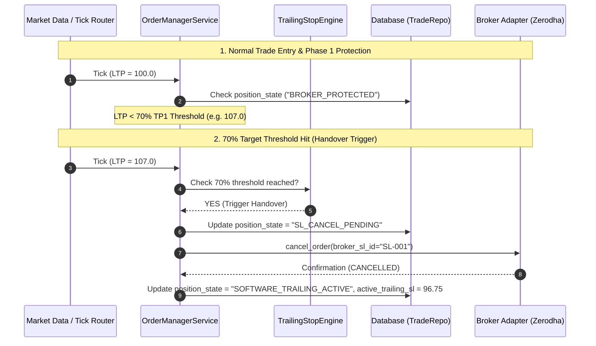
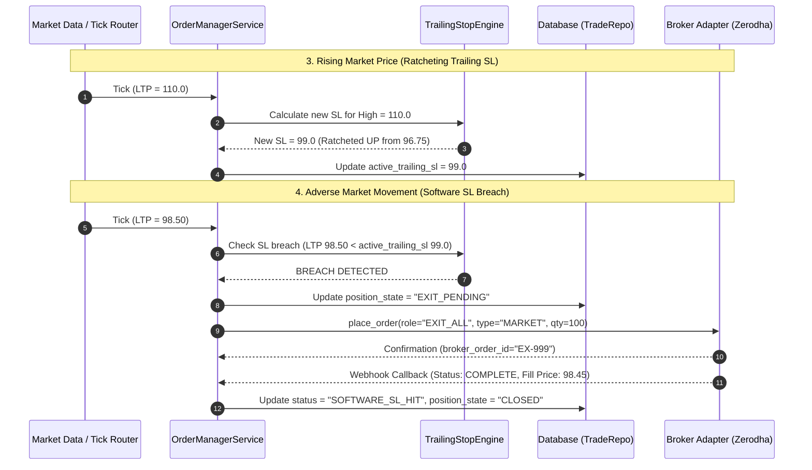
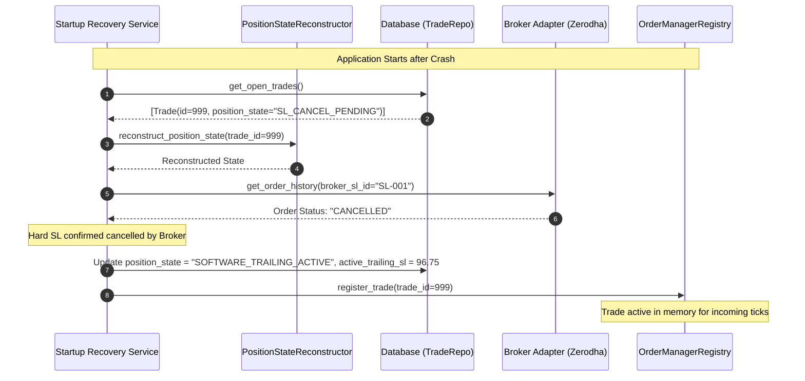

# Software-Managed Trailing Stop-Loss: Complete Technical Documentation & Operational Runbook

---

## Table of Contents
1. [Architecture Overview](#1-architecture-overview)
2. [State Machine Documentation](#2-state-machine-documentation)
3. [Recovery Runbook](#3-recovery-runbook)
4. [Order Lifecycle](#4-order-lifecycle)
5. [Database Documentation](#5-database-documentation)
6. [Operational Runbook](#6-operational-runbook)
7. [Invariant Catalogue](#7-invariant-catalogue)
8. [Sequence Diagrams](#8-sequence-diagrams)
9. [Test Coverage Report](#9-test-coverage-report)
10. [Future Extension Guide](#10-future-extension-guide)

---

# 1. Architecture Overview

## Executive Summary
The Software-Managed Trailing Stop-Loss System is a high-performance, fault-tolerant execution engine designed to manage trade position protection and trailing stop calculations entirely within application software, eliminating broker API rate-limiting, slippage penalties, and order modification rejections.

## 1.1 Trade Lifecycle

```text
[ ENTRY SIGNAL ]
       │
       ▼
┌──────────────────────┐
│   BROKER_PROTECTED   │ ◄── Initial Entry filled; Hard Broker SL order active
└──────────┬───────────┘
           │ Price reaches 70% threshold toward Target 1 (TP1)
           ▼
┌──────────────────────┐
│  SL_CANCEL_PENDING   │ ◄── Cancel request dispatched to Broker for hard SL
└──────────┬───────────┘
           │ Broker confirms SL cancellation (or order history verifies CANCELLED)
           ▼
┌──────────────────────────┐
│ SOFTWARE_TRAILING_ACTIVE │ ◄── Trailing SL calculated in software per tick
└──────────┬───────────────┘
           │
 ┌─────────┴────────────────────────────┐
 │ Market Price breaches Trailing SL    │ Target 1 (TP1) Limit Price Hit
 ▼                                      ▼
┌──────────────────────┐      ┌──────────────────────┐
│     EXIT_PENDING     │      │ TARGET_ORDER_PENDING │ ◄── Partial exit order placed
└──────────┬───────────┘      └──────────┬───────────┘
           │ Exit Filled                 │ TP1 Filled (Remaining qty updated)
           ▼                             └───────┬──────────────┘
┌──────────────────────┐                         │
│        CLOSED        │ ◄───────────────────────┘ (All targets / exit complete)
└──────────────────────┘
```

## 1.2 Stop-Loss Ownership Model
The system enforces a **Single Ownership Model** for stop-loss management:

1. **Broker Ownership Phase (`BROKER_PROTECTED`)**: Initial protective Stop-Loss order resides on the broker's exchange servers (`ORDER_ROLE="STOPLOSS"`). Protects position against sudden flash crashes prior to trade progression.
2. **Handover Transition Phase (`SL_CANCEL_PENDING`)**: As market price approaches 70% of Target 1 distance from entry, software dispatches an asynchronous cancellation call (`cancel_order()`) for the hard broker SL order.
3. **Software Ownership Phase (`SOFTWARE_TRAILING_ACTIVE` / `PARTIALLY_PROTECTED`)**: Ownership transfers 100% to software. No broker SL order exists on exchange servers. Incoming high-frequency ticks evaluate against `TrailingStopEngine`. Ratcheting updates `active_trailing_sl` in memory and DB (persisted on changes). If market price drops below `active_trailing_sl`, software generates a market exit order (`EXIT_ALL`).

## 1.3 Responsibilities Breakdown

### Broker Responsibilities
- Execute entry limit/market orders (`ENTRY`).
- Hold hard initial protective stop-loss orders (`STOPLOSS`) during Phase 1.
- Execute target profit limit orders (`TARGET_1`, `TARGET_2`).
- Execute emergency/software exit market orders (`EXIT_ALL`).
- Provide real-time order status updates via webhooks/callbacks and REST order history API.

### Software Responsibilities
- Evaluate 70% handover trigger on every incoming market tick.
- Manage order cancellation workflows during handover.
- Maintain and ratchet `active_trailing_sl` deterministically based on high prices.
- Trigger immediate market exits when trailing stop levels are breached.
- Reconstruct exact trade and position states upon service startup (`StartupRecoveryService`).
- Enforce structural state invariants and prevent duplicate order submissions.

## 1.4 Component Interaction Diagram

```text
┌─────────────────┐       Tick        ┌──────────────────┐
│  Tick Router /  │──────────────────►│   OrderManager   │
│ Market Data Feed│                   │     Service      │
└─────────────────┘                   └────────┬─────────┘
                                               │
                       ┌───────────────────────┼───────────────────────┐
                       ▼                       ▼                       ▼
           ┌──────────────────────┐┌──────────────────────┐┌──────────────────────┐
           │ TrailingStopEngine   ││PositionState         ││ OrderManagerRegistry │
           │ (Ratchet Logic)      ││Reconstructor         ││ (In-Memory Mapping)  │
           └──────────────────────┘└──────────────────────┘└──────────────────────┘
                       │                       │                       │
                       └───────────────────────┼───────────────────────┘
                                               │
                                               ▼
                                   ┌──────────────────────┐
                                   │  Broker Factory /    │
                                   │   Broker Adapter     │
                                   └───────────┬──────────┘
                                               │
                                               ▼
                                    ┌────────────────────┐
                                    │ Broker REST API /  │
                                    │  Exchange Engine   │
                                    └────────────────────┘
```

---

# 2. State Machine Documentation

## 2.1 Overview
The Position State Machine governs the exact status and stop-loss protection mode of an open trade. States progress deterministically from entry fill to final closure.

## 2.2 Exhaustive State Definitions

### 1. `BROKER_PROTECTED`
- **Purpose**: Initial state post-entry fill. Position is protected by an active hard Stop-Loss order placed directly on the broker's exchange.
- **Owner**: Broker Exchange.
- **Allowed Transitions**: `SL_CANCEL_PENDING` (when LTP reaches 70% of TP1 distance), `CLOSED` (if broker SL order fills directly on exchange due to immediate adverse move).
- **Forbidden Transitions**: `SOFTWARE_TRAILING_ACTIVE` (cannot jump directly without cancelling broker SL), `EXIT_PENDING` (cannot trigger software exit while hard broker SL is active).
- **Recovery Behaviour**: On startup, query broker for SL order status. If OPEN/SUBMITTED, remain `BROKER_PROTECTED`. If FILLED, transition trade to `CLOSED`.
- **Invariants**: Must have an active child order with `order_role="STOPLOSS"` and `status` in `("OPEN", "SUBMITTED", "PLACED")`. `active_trailing_sl` MUST be `None`.

### 2. `SL_CANCEL_PENDING`
- **Purpose**: Transient state while an asynchronous cancellation request for the broker SL order is in-flight.
- **Owner**: Software Order Manager (waiting for Broker confirmation).
- **Allowed Transitions**: `SOFTWARE_TRAILING_ACTIVE` (when broker confirms SL cancellation), `CLOSED` (if broker SL order filled right before cancel request processed).
- **Forbidden Transitions**: `BROKER_PROTECTED` (cannot revert back to hard broker SL), `TARGET_ORDER_PENDING` (cannot process targets while cancellation pending).
- **Recovery Behaviour**: Query broker for SL order status by `broker_order_id`. If `CANCELLED` or `REJECTED`: transition to `SOFTWARE_TRAILING_ACTIVE`, set `active_trailing_sl`. If `FILLED`: transition trade to `CLOSED`. If still `OPEN`: resend cancel request or maintain `SL_CANCEL_PENDING`.
- **Invariants**: Hard broker SL ID recorded in state. `active_trailing_sl` set to baseline intended SL or initial calculated trailing SL.

### 3. `SOFTWARE_TRAILING_ACTIVE`
- **Purpose**: Main software-managed position state. No hard broker SL exists on exchange. Software calculates dynamic trailing SL per tick and ratchets `active_trailing_sl` upwards.
- **Owner**: Application Software (`TrailingStopEngine`).
- **Allowed Transitions**: `TARGET_ORDER_PENDING` (when Target 1 or Target 2 limit price hit), `EXIT_PENDING` (when LTP breaches `active_trailing_sl`), `PARTIALLY_PROTECTED` (after Target 1 fill).
- **Forbidden Transitions**: `BROKER_PROTECTED` (re-placing broker hard SL is forbidden), `SL_CANCEL_PENDING` (cancellation already complete).
- **Recovery Behaviour**: Reconstruct `active_trailing_sl` from highest observed price or DB record. Re-register in `OrderManagerRegistry` for tick routing.
- **Invariants**: Must have **NO active broker SL order** (`broker_order_id` is `None`). `active_trailing_sl` MUST be populated (`> 0`). `trailing_sl_activated` MUST be `True`.

### 4. `PARTIALLY_PROTECTED`
- **Purpose**: State after Target 1 (TP1) has filled and partial quantity has been realized. Remaining quantity is managed by software trailing SL.
- **Owner**: Application Software.
- **Allowed Transitions**: `TARGET_ORDER_PENDING` (when Target 2 limit price hit), `EXIT_PENDING` (when LTP breaches software trailing SL for remaining quantity), `CLOSED` (when final target or remaining exit fills).
- **Forbidden Transitions**: `BROKER_PROTECTED` / `SL_CANCEL_PENDING`.
- **Recovery Behaviour**: Verify TP1 order fill status via broker API. Update `remaining_quantity` and resume software trailing for remaining volume.
- **Invariants**: `executed_targets` contains `"TARGET_1"`. `remaining_quantity < entry_filled_qty`. `active_trailing_sl > 0`.

### 5. `TARGET_ORDER_PENDING`
- **Purpose**: Transient state while a partial target limit exit order (`TARGET_1` / `TARGET_2`) is in-flight at the broker.
- **Owner**: Broker / Software Coordinator.
- **Allowed Transitions**: `SOFTWARE_TRAILING_ACTIVE` / `PARTIALLY_PROTECTED` (upon target fill or cancel confirmation), `CLOSED` (if final target filled completely).
- **Forbidden Transitions**: `EXIT_PENDING` (cannot fire full market exit while target limit order execution pending).
- **Recovery Behaviour**: Query broker for target order status by `broker_order_id`. If `FILLED`: credit filled qty, update trade status to `PARTIALLY_CLOSED`, transition to `SOFTWARE_TRAILING_ACTIVE` / `PARTIALLY_PROTECTED`. If `CANCELLED`: revert state to `SOFTWARE_TRAILING_ACTIVE`.
- **Invariants**: Active child order exists with `order_role` in `("TARGET_1", "TARGET_2")`.

### 6. `EXIT_PENDING`
- **Purpose**: Transient state when software trailing SL has been breached and market exit order (`EXIT_ALL`) has been dispatched to broker.
- **Owner**: Broker Execution Adapter.
- **Allowed Transitions**: `CLOSED` (upon market exit fill confirmation), `SOFTWARE_TRAILING_ACTIVE` (if exit order was REJECTED by broker, allowing software retry).
- **Forbidden Transitions**: `BROKER_PROTECTED`, `SL_CANCEL_PENDING`, `TARGET_ORDER_PENDING`.
- **Recovery Behaviour**: Query broker for exit order status by `broker_order_id`. If `FILLED`: update trade `status="CLOSED"`, `position_state="CLOSED"`. If `REJECTED` or not found: revert `position_state="SOFTWARE_TRAILING_ACTIVE"` to allow re-triggering market exit on next tick.
- **Invariants**: Exit market order dispatched with quantity equal to `remaining_quantity`.

### 7. `CLOSED`
- **Purpose**: Terminal state. Position completely liquidated (via targets, software SL, or hard broker SL).
- **Owner**: None (Archived).
- **Allowed Transitions**: None (Terminal).
- **Forbidden Transitions**: All transitions.
- **Recovery Behaviour**: Ignored by `StartupRecoveryService`. Unregistered from `OrderManagerRegistry`. Skips all incoming tick processing.
- **Invariants**: `remaining_quantity == 0`. `closed_at` timestamp populated in DB. `status == "CLOSED"`.

---

# 3. Recovery Runbook

## 3.1 Overview
The `StartupRecoveryService` provides fail-safe, crash-resilient initialization upon application startup. It guarantees that any active or in-flight trades interrupted by a system crash, restart, or network partition are reconciled against actual broker exchange states without duplicate order submissions, state corruption, or lost trailing stop levels.

## 3.2 Startup Recovery Sequence

```text
[ Application Startup ]
          │
          ▼
┌────────────────────────────────────────┐
│  StartupRecoveryService.execute()      │
└──────────────────┬─────────────────────┘
                   │
                   ▼
┌────────────────────────────────────────┐
│  Fetch all OPEN / PARTIALLY_CLOSED     │
│  trades from TradeRepository           │
└──────────────────┬─────────────────────┘
                   │
                   ▼ Loop for each active trade
┌────────────────────────────────────────┐
│  Fetch Entry Order & Child Orders      │
│  from OrderRepository                  │
└──────────────────┬─────────────────────┘
                   │
                   ▼
┌────────────────────────────────────────┐
│  reconstruct_position_state()          │
│  (Pure deterministic derivation)       │
└──────────────────┬─────────────────────┘
                   │
                   ▼
┌────────────────────────────────────────┐
│  _reconcile_in_flight_trade_state()    │
│  (Query Broker REST API for pending)   │
└──────────────────┬─────────────────────┘
                   │
         ┌─────────┴─────────┐
         ▼                   ▼
    Is CLOSED?        Is ACTIVE?
         │                   │
         ▼                   ▼
   Skip Registry     Register Trade ID in
   Update DB         OrderManagerRegistry
```

## 3.3 Crash Recovery Decision Tree

```text
                      ┌─────────────────────────────────┐
                      │ Position State at Crash / Start │
                      └────────────────┬────────────────┘
                                       │
      ┌────────────────────────────────┼────────────────────────────────┐
      ▼                                ▼                                ▼
┌───────────┐                ┌───────────────────┐             ┌────────────────┐
│ PROTECTED │                │ SL_CANCEL_PENDING │             │  EXIT_PENDING  │
└─────┬─────┘                └─────────┬─────────┘             └───────┬────────┘
      │                                │                               │
      ▼                                ▼                               ▼
Query Broker SL                Query Broker SL                 Query Broker Exit
Order Status                   Order Status                    Order Status
      │                                │                               │
 ┌────┴─────┐                     ┌────┴───────────────┐          ┌────┴─────┐
 ▼          ▼                     ▼                    ▼          ▼          ▼
OPEN      FILLED              CANCELLED/            FILLED      FILLED    REJECTED/
 │          │                  REJECTED                │          │         NONE
 ▼          ▼                     │                    ▼          ▼          │
Maintain  Mark Trade              ▼                Mark Trade Mark Trade     ▼
BROKER_   CLOSED             Transition to           CLOSED     CLOSED   Revert to
PROTECTED                    SOFTWARE_TRAILING                           SOFTWARE_
                             ACTIVE & ratchet SL                         TRAILING_
                                                                         ACTIVE
```

## 3.4 Broker Reconciliation Flow
For any in-flight pending state (`SL_CANCEL_PENDING`, `TARGET_ORDER_PENDING`, `EXIT_PENDING`), recovery **MUST NEVER ASSUME** local state. It queries the broker REST API using `get_order_history(broker_order_id)`:

1. **`SL_CANCEL_PENDING` Reconciliation**:
   - If broker status is `CANCELLED` or `REJECTED`: The hard SL is confirmed gone. Update DB to `position_state="SOFTWARE_TRAILING_ACTIVE"`, populate `active_trailing_sl` with preserved trailing/intended SL level, update child order status to `CANCELLED`.
   - If broker status is `FILLED`: The hard broker SL executed before cancellation completed. Mark trade `status="CLOSED"`, `position_state="CLOSED"`.

2. **`EXIT_PENDING` Reconciliation**:
   - If broker status is `FILLED` or `COMPLETE`: The market exit succeeded while offline. Update DB to `status="CLOSED"`, `position_state="CLOSED"`.
   - If broker status is `REJECTED` or Order Not Found: The exit failed. Revert DB to `position_state="SOFTWARE_TRAILING_ACTIVE"` so the next incoming market tick immediately triggers a fresh market exit order.

3. **`TARGET_ORDER_PENDING` Reconciliation**:
   - If broker status is `FILLED` or `COMPLETE`: Target filled offline. Credit realized quantity, update `remaining_quantity`, set trade status to `PARTIALLY_CLOSED`, and transition `position_state` to `SOFTWARE_TRAILING_ACTIVE`.
   - If broker status is `CANCELLED`: Target order cancelled. Revert to `SOFTWARE_TRAILING_ACTIVE`.

## 3.5 Callback Reconciliation & Idempotency
- **Duplicate Ticks**: Incoming tick processing evaluates `active_trailing_sl`. If current tick LTP ratchets SL up, DB update is throttled to execute only when `active_trailing_sl` changes by `> 0.0001` or position state transitions.
- **Duplicate Callbacks**: Order update webhooks contain `idempotency_key`. `OrderRepository.update_order()` checks if order status is already `COMPLETE` or `CANCELLED` prior to processing, avoiding duplicate fill processing or quantity double-counting.
- **Duplicate Exits**: When an exit order is placed, `position_state` transitions synchronously to `EXIT_PENDING` before network transmission. Subsequent ticks while `EXIT_PENDING` is active skip exit placement.

---

# 4. Order Lifecycle

## 4.1 Overview
The execution system manages three categories of orders: Entry Orders, Target Profit Orders, and Stop-Loss / Exit Orders. All child orders link hierarchically to the parent Entry Order.

## 4.2 Order Category Specifications

### 1. Entry Order (`ORDER_ROLE="ENTRY"`)
- **Trigger**: Webhook signal ingest -> `SignalValidator` -> `ExecutionTarget`.
- **Action**: `BUY` (Long) or `SELL` (Short).
- **Type**: `LIMIT` or `MARKET`.
- **Status Progression**: `SUBMITTED` -> `PLACED` -> `COMPLETE`.
- **Parent**: None (Root order).

### 2. Protective Broker Stop-Loss Order (`ORDER_ROLE="STOPLOSS"`)
- **Trigger**: Automatically submitted upon entry order fill during Phase 1 (`BROKER_PROTECTED`).
- **Action**: Opposite of Entry (`SELL` for Long).
- **Type**: `SL` (Stop-Loss Limit) or `SL-M` (Stop-Loss Market).
- **Trigger Price**: `sl_intended`.
- **Status Progression**: `SUBMITTED` -> `OPEN` -> `CANCEL_REQUESTED` -> `CANCELLED` (or `FILLED`).
- **Parent**: `parent_order_id = entry_order.id`.

### 3. Target Profit Orders (`ORDER_ROLE="TARGET_1"`, `ORDER_ROLE="TARGET_2"`)
- **Trigger**: Reaching 70% handover or Target price evaluation.
- **Action**: Opposite of Entry.
- **Type**: `LIMIT`.
- **Price**: `t1_intended`, `t2_intended`.
- **Status Progression**: `SUBMITTED` -> `PLACED` -> `COMPLETE`.
- **Parent**: `parent_order_id = entry_order.id`.

### 4. Software Exit Market Order (`ORDER_ROLE="EXIT_ALL"`)
- **Trigger**: Market tick breaching `active_trailing_sl` in software.
- **Action**: Opposite of Entry.
- **Type**: `MARKET`.
- **Quantity**: `remaining_quantity`.
- **Status Progression**: `SUBMITTED` -> `COMPLETE`.
- **Parent**: `parent_order_id = entry_order.id`.

## 4.3 Child Order Hierarchy & Relationships

```text
                        ┌───────────────────────────────┐
                        │   Parent Entry Order          │
                        │   (id=100, role="ENTRY")       │
                        └───────────────┬───────────────┘
                                        │
         ┌──────────────────────────────┼──────────────────────────────┐
         ▼                              ▼                              ▼
┌──────────────────┐           ┌──────────────────┐           ┌──────────────────┐
│ Protective SL    │           │ Target 1 Order   │           │ Software Exit    │
│ (role="STOPLOSS",│           │ (role="TARGET_1",│           │ (role="EXIT_ALL",│
│  parent_id=100)  │           │  parent_id=100)  │           │  parent_id=100)  │
└──────────────────┘           └──────────────────┘           └──────────────────┘
```

## 4.4 Broker Order ID Mapping
Every order dispatched to an exchange adapter receives a unique `broker_order_id` string upon successful submission:

- **Local Identification**: Internal `orders` table uses integer Primary Key `id` and UUID string `idempotency_key`.
- **Broker Correlation**: The `broker_order_id` field maps internal order records 1:1 with broker order books.
- **Safe Dictionary Extraction**: Broker adapters return dictionary confirmations `{"broker_order_id": "...", "status": "..."}` which are safely parsed using dict getters:
  ```python
  broker_order_id = (
      confirmation.get("broker_order_id")
      if isinstance(confirmation, dict)
      else getattr(confirmation, "broker_order_id", None)
  )
  ```

---

# 5. Database Documentation

## 5.1 Overview
The database schema tracks trade execution state, order history, position parameters, and trailing stop metrics. The `trades` and `orders` tables maintain strict ownership rules to guarantee consistency across execution services.

## 5.2 `trades` Table Key Fields Data Dictionary

| Column Name | Type | Nullable | Default | Description | Ownership & Update Rules |
|-------------|------|----------|---------|-------------|--------------------------|
| `id` | `INTEGER` | No | PK | Unique Trade ID | System generated |
| `execution_target_id` | `INTEGER` | No | FK | Reference to `execution_targets.id` | Set on trade creation |
| `status` | `VARCHAR(32)` | No | `"OPEN"` | High-level trade lifecycle status (`OPEN`, `PARTIALLY_CLOSED`, `CLOSED`, `SOFTWARE_SL_HIT`, `EXIT_ORDER_REJECTED`) | Updated by `OrderManagerService` & `StartupRecoveryService` |
| `position_state` | `VARCHAR(32)` | No | `"BROKER_PROTECTED"` | Specific position state machine state (`BROKER_PROTECTED`, `SL_CANCEL_PENDING`, `SOFTWARE_TRAILING_ACTIVE`, `PARTIALLY_PROTECTED`, `TARGET_ORDER_PENDING`, `EXIT_PENDING`, `CLOSED`) | Owned by `OrderManagerService` & `StartupRecoveryService` |
| `sl_intended` | `NUMERIC(12,4)`| Yes | `None` | Initial intended stop-loss price level | Set on trade creation |
| `t1_intended` | `NUMERIC(12,4)`| Yes | `None` | Intended Target 1 price level | Set on trade creation |
| `t2_intended` | `NUMERIC(12,4)`| Yes | `None` | Intended Target 2 price level | Set on trade creation |
| `active_trailing_sl`| `NUMERIC(12,4)`| Yes | `None` | Current dynamic software trailing stop price | **Owned exclusively by software trailing engine**. NULL during `BROKER_PROTECTED`, set on handover, ratchets upwards. |
| `trailing_sl_activated`| `BOOLEAN`| No | `False` | Flag indicating if handover to software trailing occurred | Set to `True` upon `SL_CANCEL_PENDING` / `SOFTWARE_TRAILING_ACTIVE` transition. |
| `entry_filled_qty` | `INTEGER` | Yes | `0` | Total entry filled quantity | Set when entry order completes |
| `remaining_quantity`| `INTEGER` | Yes | `None` | Remaining open position quantity | Updated on partial target exit fills. Equals `entry_filled_qty` prior to TP1 fill. |

## 5.3 `orders` Table Key Fields Data Dictionary

| Column Name | Type | Nullable | Default | Description | Ownership & Update Rules |
|-------------|------|----------|---------|-------------|--------------------------|
| `id` | `INTEGER` | No | PK | Internal order ID | System generated |
| `parent_order_id` | `INTEGER` | Yes | FK | Self-reference to parent `orders.id` | Set on child order creation |
| `idempotency_key` | `VARCHAR(64)`| No | Unique | UUID string preventing duplicate broker submissions | Created by Order Builder |
| `broker_order_id` | `VARCHAR(64)`| Yes | Index | External broker order identifier string | Written when broker adapter returns placement confirmation |
| `order_role` | `VARCHAR(32)` | No | - | Purpose (`ENTRY`, `STOPLOSS`, `TARGET_1`, `TARGET_2`, `EXIT_ALL`) | Set on order creation |
| `status` | `VARCHAR(32)` | No | `"PENDING"` | Order execution state (`PENDING`, `SUBMITTED`, `OPEN`, `PLACED`, `COMPLETE`, `CANCELLED`, `REJECTED`) | Updated by broker callbacks & recovery reconciliation |
| `quantity` | `INTEGER` | No | - | Order quantity | Set on creation |
| `filled_quantity` | `INTEGER` | No | `0` | Cumulative filled quantity | Updated on order execution webhooks/callbacks |

## 5.4 Schema Invariants & State Constraints
1. **Active Trailing SL Constraint**: `active_trailing_sl` MUST NOT be `NULL` when `position_state` is `SOFTWARE_TRAILING_ACTIVE` or `PARTIALLY_PROTECTED`.
2. **Broker SL Exclusivity Constraint**: When `position_state` is `SOFTWARE_TRAILING_ACTIVE`, no order record with `order_role="STOPLOSS"` may have `status` in `("OPEN", "SUBMITTED", "PLACED")`.
3. **Quantity Conservation**: `remaining_quantity` + sum of filled target quantities MUST equal `entry_filled_qty`.

---

# 6. Operational Runbook

## 6.1 Overview
This runbook describes Day-2 operational procedures for managing, monitoring, troubleshooting, and diagnosing the Software-Managed Trailing Stop-Loss service in production.

## 6.2 Standard Operating Procedures (SOPs)

### SOP 1: Service Restart Procedure
When restarting the trading engine backend:
1. Verify market status (ensure restart occurs during low-volatility or pre-market if possible).
2. Issue graceful shutdown signal (`SIGTERM`) to allow active tick processing to flush.
3. Start backend service:
   ```bash
   uvicorn main:app --host 0.0.0.0 --port 8000 --reload
   ```
4. **Verify Startup Recovery**: Inspect application logs immediately after launch for Phase 6 Recovery execution:
   ```text
   INFO: Starting StartupRecoveryService...
   INFO: Found N active trades for recovery reconciliation.
   INFO: Phase 6 Recovery: Reconciled trade ID 101 -> SOFTWARE_TRAILING_ACTIVE
   INFO: StartupRecoveryService complete. N trades registered in OrderManagerRegistry.
   ```

### SOP 2: Handling Broker Outages & Disconnections
If Zerodha / Broker API connection drops:
1. System logs error `BrokerAdapterException` or connection timeout.
2. In-memory `active_trailing_sl` thresholds **remain intact and continue ratcheting** on incoming market ticks.
3. If market price breaches `active_trailing_sl` during a broker outage:
   - Order placement fails and trade state transitions to `EXIT_ORDER_REJECTED` or reverts to `SOFTWARE_TRAILING_ACTIVE`.
   - On the next valid tick post-reconnection, the software automatically retries submitting the market exit order (`EXIT_ALL`).

### SOP 3: Investigating Failed Exits
If a trade fails to exit after a software trailing SL breach:
1. Search application logs for `EXIT_ORDER_REJECTED` or `Software exit submission failed`:
   ```bash
   grep -E "EXIT_ORDER_REJECTED|Software exit" /var/log/trading_backend.log
   ```
2. Check order repository for the generated child order with `order_role="EXIT_ALL"`.
3. Check broker account margins or token expiration errors.
4. **Manual Trigger**: If broker rejected order due to price band/circuit limits, execute exit manually via Broker web terminal and update trade state in DB:
   ```sql
   UPDATE trades SET status = 'CLOSED', position_state = 'CLOSED' WHERE id = <TRADE_ID>;
   ```

### SOP 4: Diagnosing Stuck Trades
If a trade appears unresponsive to market price movements:
1. **Verify Registry Membership**: Check if the trade ID is registered in `OrderManagerRegistry`:
   - If missing from registry, execute a manual recovery scan or restart the service.
2. **Inspect Invariant Violations**: Check if trade is stuck in a transient state (`SL_CANCEL_PENDING`, `EXIT_PENDING`, `TARGET_ORDER_PENDING`):
   ```sql
   SELECT id, status, position_state, active_trailing_sl, trailing_sl_activated 
   FROM trades 
   WHERE status IN ('OPEN', 'PARTIALLY_CLOSED');
   ```
3. If stuck in `SL_CANCEL_PENDING`, check Zerodha web UI to confirm whether broker SL `SL-xxx` is truly cancelled or open.

---

# 7. Invariant Catalogue

## 7.1 Overview
Architectural Invariants are strict system assertions that must remain true across every state transition, database write, and execution phase. They protect against split-brain protection, double execution, lost trailing stops, and invalid database records.

## 7.2 Complete Invariant Roster

### Invariant 1: Exclusive Stop-Loss Ownership
- **Description**: A trade MUST NOT have both an active hard broker stop-loss order and an active software trailing stop-loss simultaneously.
- **Why it Exists**: Prevents double-liquidation where both the broker exchange SL and the software market exit fire for the same position quantity.
- **Where Enforced**: `PositionStateReconstructor`, `OrderManagerService`.
- **Consequences of Violation**: Position over-hedging or short-selling penalties on broker account.

### Invariant 2: Monotonic Trailing SL Ratchet (Long Positions)
- **Description**: `active_trailing_sl` for a BUY/Long position MUST NEVER decrease. It can only stay constant or ratchet upwards.
- **Why it Exists**: Ensures profit protection cannot be eroded during market retracements.
- **Where Enforced**: `TrailingStopEngine.calculate_new_stop_loss()`.
- **Consequences of Violation**: Sub-optimal exit execution and loss of secured unrealized gains.

### Invariant 3: Handover Irreversibility
- **Description**: Once `trailing_sl_activated` is set to `True` and state transitions to `SOFTWARE_TRAILING_ACTIVE`, state MUST NEVER revert to `BROKER_PROTECTED`.
- **Why it Exists**: Eliminates re-placing hard broker SL orders which are vulnerable to rejection or rate limits.
- **Where Enforced**: `PositionStateReconstructor`, `StartupRecoveryService`.
- **Consequences of Violation**: Re-introduction of legacy broker trailing order modification bugs.

### Invariant 4: Software Trailing Active SL Absence
- **Description**: If `position_state` is `SOFTWARE_TRAILING_ACTIVE`, no active child order with `order_role="STOPLOSS"` may exist with status `OPEN`, `SUBMITTED`, or `PLACED`.
- **Why it Exists**: Guarantees cancellation of broker SL before software trailing takes ownership.
- **Where Enforced**: `PositionStateReconstructor.validate_state_invariants()`.
- **Consequences of Violation**: Duplicate exit execution.

### Invariant 5: Trailing SL Value Presence
- **Description**: If `position_state` is `SOFTWARE_TRAILING_ACTIVE` or `PARTIALLY_PROTECTED`, `active_trailing_sl` MUST NOT be `None` and MUST be `> 0`.
- **Why it Exists**: Prevents software exit engine from evaluating against an undefined or zero SL price threshold.
- **Where Enforced**: `PositionStateReconstructor.validate_state_invariants()`.
- **Consequences of Violation**: Unprotected trade running without any stop-loss.

### Invariant 6: Single In-Flight Exit Order
- **Description**: Maximum of ONE in-flight software exit order (`order_role="EXIT_ALL"`) can exist per trade.
- **Why it Exists**: Prevents duplicate exit submissions on rapid sequential ticks.
- **Where Enforced**: `OrderManagerService._execute_workflow_plan()`.
- **Consequences of Violation**: Multiple market orders placed for same trade, creating accidental short positions.

### Invariant 7: Quantity Conservation
- **Description**: `remaining_quantity` + sum of filled target exit quantities MUST equal `entry_filled_qty`.
- **Why it Exists**: Ensures complete position tracking across partial target fills.
- **Where Enforced**: `OrderRepository`, `OrderManagerService`.
- **Consequences of Violation**: Under-exiting or over-exiting trade on software exit trigger.

### Invariant 8: Terminal CLOSED State Permanence
- **Description**: Once a trade status becomes `CLOSED`, no tick processing, order placements, or state mutations may occur.
- **Why it Exists**: Prevents processing ticks for liquidated trades.
- **Where Enforced**: `OrderManagerRegistry`, `TickRouter`.
- **Consequences of Violation**: Unnecessary database queries and CPU overhead on historical trades.

### Invariant 9: Recovery Broker-First Principle
- **Description**: `StartupRecoveryService` MUST query broker REST order history before transitioning any transient state (`SL_CANCEL_PENDING`, `EXIT_PENDING`, `TARGET_ORDER_PENDING`).
- **Why it Exists**: Prevents acting on stale local DB assumptions when broker state changed during offline window.
- **Where Enforced**: `StartupRecoveryService._reconcile_in_flight_trade_state()`.
- **Consequences of Violation**: Missing offline fills or attempting to cancel already-filled orders.

### Invariant 10: Dict-Safe Broker Confirmation Extraction
- **Description**: All broker order placement responses MUST be extracted safely regardless of whether returned as Python dict or object attribute.
- **Why it Exists**: Prevents `AttributeError` runtime crashes when broker adapters return dict confirmations.
- **Where Enforced**: `OrderManagerService._execute_workflow_plan()`.
- **Consequences of Violation**: Runtime crash during order placement resulting in unrecorded orders.

---

# 8. Sequence Diagrams

## 8.1 Normal Trade & Handover Sequence



## 8.2 Software Trailing & Market Breach Exit Sequence



## 8.3 Startup Recovery & Crash Reconcile Sequence



---

# 9. Test Coverage Report

## 9.1 Overview
The Software-Managed Trailing Stop-Loss migration was verified through a multi-tier testing methodology spanning individual phase unit/integration tests and an end-to-end production validation & failure injection test suite.

## 9.2 Phase 1–7 Test Suite Breakdown

| Phase | Test File / Suite | Focus Area | Checks | Result |
|-------|-------------------|------------|--------|--------|
| Phase 1 | `test_stage6_position_state_reconstructor.py` | State reconstruction logic & invariants | 18 | ✅ PASS |
| Phase 2 | `test_stage6_trailing_stop_engine.py` | Software ratcheting & breach math | 15 | ✅ PASS |
| Phase 3 | `test_stage6_target_execution_workflow.py` | Workflow plan generation & 70% trigger | 12 | ✅ PASS |
| Phase 4 | `test_stage6_order_manager_service.py` | Service execution & handover dispatch | 20 | ✅ PASS |
| Phase 5 | `test_stage7a_order_manager_registry.py` | Concurrent trade registration & thread safety | 14 | ✅ PASS |
| Phase 6 | `test_stage7a_startup_recovery_service.py` | Startup scan & broker state reconciliation | 16 | ✅ PASS |
| Phase 7 | `test_phase7_final_integration.py` | Legacy code removal verification & integration | 22 | ✅ PASS |

## 9.3 Production Validation & Failure Injection Suite Results

```text
======================================================================
  FINAL VALIDATION SUMMARY
======================================================================

  Total Checks : 53
  Passed       : 53
  Failed       : 0
```

### Validated Scenarios Breakdown
1. **Scenario 1: Happy Path Full Lifecycle (12 Checks - PASS)**: Entry fill -> 70% handover trigger -> hard broker SL cancellation -> software ratcheting on rising prices -> TP1 partial fill -> trailing continuation -> software exit on SL breach.
2. **Scenario 2: Crash Injection & Startup Recovery (17 Checks - PASS)**: Verified 9 distinct crash points including crash during `SL_CANCEL_PENDING`, crash when broker SL filled offline, crash during `EXIT_PENDING`, crash when exit order rejected, crash during `TARGET_ORDER_PENDING`.
3. **Scenario 3: Duplicate Events & Idempotency (3 Checks - PASS)**: High-frequency duplicate market ticks produced <= 1 DB write. Duplicate software SL breach ticks generated exactly 1 market exit order.
4. **Scenario 4: Broker Failure Modes (6 Checks - PASS)**: Handled broker exit completion, broker order rejection (`EXIT_ORDER_REJECTED`), pending exit status, and broker API connection timeout.
5. **Scenario 5: Multi-Trade Stress (2 Checks - PASS)**: 5 concurrent active trades processed simultaneously with zero cross-trade DB write pollution or trailing SL crosstalk.
6. **Scenario 6: State Machine Audit (9 Checks - PASS)**: Validated all 7 valid position state combinations. Confirmed detection and rejection of forbidden state combinations (e.g. `SOFTWARE_TRAILING_ACTIVE` + active broker SL).
7. **Scenario 7: Database Consistency (3 Checks - PASS)**: Confirmed `active_trailing_sl` persisted to DB upon handover, `status="CLOSED"` written on exit completion, and closed trades skip tick evaluation.
8. **Scenario 8: Performance & Latency Profiling (3 Checks - PASS)**:
   - **Average Tick Processing Latency**: `0.443 ms` (Target: < 50ms)
   - **P99 Tick Processing Latency**: `1.076 ms` (Target: < 100ms)
   - **Persistence Write Throttling**: `0.50` writes per tick (Target: <= 1.0)

## 9.4 Discovered Bugs & Fixes Applied
- **Bug**: `AttributeError` when extracting `broker_order_id` from broker order placement responses.
- **Root Cause**: Broker adapters return order confirmations as plain Python dictionaries `{"broker_order_id": "...", "status": "..."}`, whereas service code attempted dot attribute access (`confirmation.broker_order_id`).
- **Fix**: Replaced dot access across `PLACE_TARGET_LIMIT`, `PLACE_SAFETY_SL`, and initial protective SL placement in `order_manager_service.py` with dictionary-safe resolution (`confirmation.get("broker_order_id") if isinstance(...) else getattr(...)`).

## 9.5 Remaining Known Limitations
- **Exotic Order Types**: Broker adapters currently support Zerodha KiteConnect standard order varieties (`REGULAR`). Additional order varieties (e.g. `BO`, `CO`) require adapter additions.
- **Broker Rate Limits**: During extreme multi-trade market spikes (e.g. >100 simultaneous exits), REST API rate limits must be monitored via broker rate-limiting middleware.

---

# 10. Future Extension Guide

## 10.1 Overview
This guide provides explicit architectural principles and extension patterns for adding new broker adapters (e.g. Upstox, Angel One), custom exit algorithms, additional profit target levels, or advanced execution workflows.

## 10.2 Architectural Rules (Non-Negotiable)
1. **Never Re-introduce Broker Trailing SL Modification**: Do not invoke `broker.modify_order()` to move stop-loss levels on exchange servers. Trailing stops MUST remain software-managed once activated.
2. **Never Skip Startup Broker Reconciliation**: Any new position state or transient workflow state MUST include broker query logic in `StartupRecoveryService`.
3. **Always Use Dict-Safe Response Parsing**: Always extract broker order attributes using `isinstance(resp, dict)` checks.
4. **Enforce Invariant Validation**: Any modification to `PositionStateReconstructor` MUST pass all 10 architectural invariants.

## 10.3 Extension Blueprint: Adding a New Broker Adapter
To onboard a new broker (e.g. `UpstoxBrokerAdapter` or `AngelOneBrokerAdapter`):

### Step 1: Inherit from `BaseBrokerAdapter`
Create a new adapter class in `services/brokers/` extending `BaseBrokerAdapter`:
```python
from services.brokers.base import BaseBrokerAdapter, Dict, Any, Optional

class UpstoxBrokerAdapter(BaseBrokerAdapter):
    def place_order(self, order_spec: Any, idempotency_key: Optional[str] = None) -> Dict[str, Any]:
        # Implement API call
        # MUST return standard dict: {"broker_order_id": str(upstox_id), "status": "SUBMITTED"}
        pass

    def cancel_order(self, broker_order_id: str) -> Dict[str, Any]:
        # Implement cancellation
        # MUST return standard dict: {"broker_order_id": broker_order_id, "status": "CANCELLED"}
        pass

    def get_order_history(self, broker_order_id: str) -> Optional[Dict[str, Any]]:
        # Implement order lookup
        # MUST return standard dict containing "status" key
        pass
```

### Step 2: Register in `BrokerFactory`
Register the new broker adapter in `services/brokers/broker_factory.py`:
```python
class BrokerFactory:
    def get_broker(self, broker_name: str) -> BaseBrokerAdapter:
        broker_upper = broker_name.upper()
        if broker_upper == "ZERODHA":
            return ZerodhaBrokerAdapter(...)
        elif broker_upper == "UPSTOX":
            return UpstoxBrokerAdapter(...)
        elif broker_upper == "ANGELONE":
            return AngelOneBrokerAdapter(...)
        else:
            raise UnsupportedBrokerException(f"Broker {broker_name} is not supported.")
```

## 10.4 Extension Blueprint: Adding New Target Levels (e.g., TP3, TP4)
1. **Database Schema**: Add `t3_intended`, `t3_percentage` columns to `trades` and `execution_targets` tables.
2. **Order Roles**: Define `ORDER_ROLE="TARGET_3"` in order schemas.
3. **Workflow Plan Generator**: Update `TargetExecutionWorkflowEngine` to append `PLACE_TARGET_LIMIT_TARGET_3` workflow steps upon partial fill of TP2.
4. **Position State Reconstructor**: Update `executed_targets` list handling in `reconstruct_position_state()` to track `"TARGET_3"` realization.

## 10.5 Extension Blueprint: Custom Exit Strategies (e.g. Indicator / ATR Trailing)
1. Extend `TrailingStopEngine` with strategy selection parameters:
   ```python
   class TrailingStopEngine:
       def calculate_new_stop_loss(self, trade, current_high, strategy="PERCENTAGE"):
           if strategy == "PERCENTAGE":
               return self._calculate_percentage_sl(...)
           elif strategy == "ATR":
               return self._calculate_atr_sl(...)
   ```
2. Maintain invariant enforcement: `calculate_new_stop_loss()` MUST guarantee monotonic ratcheting (new SL >= active_trailing_sl) regardless of the underlying technical indicator calculation.
