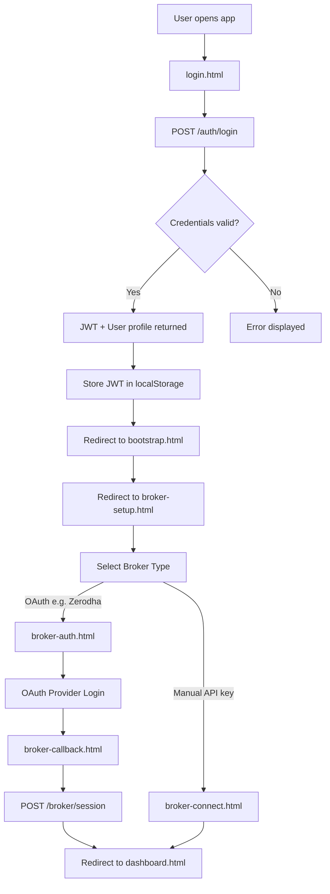
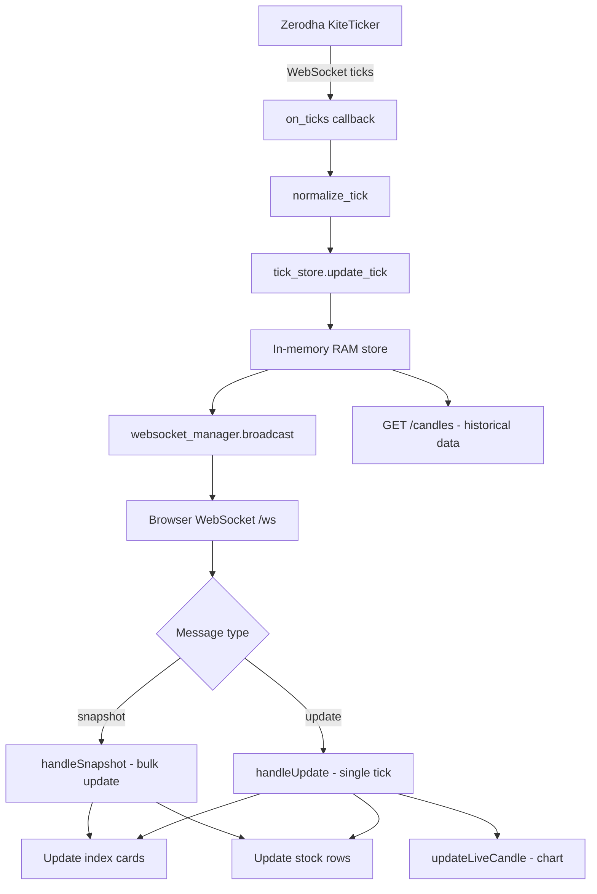
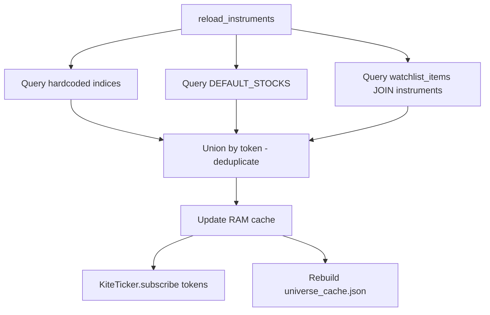
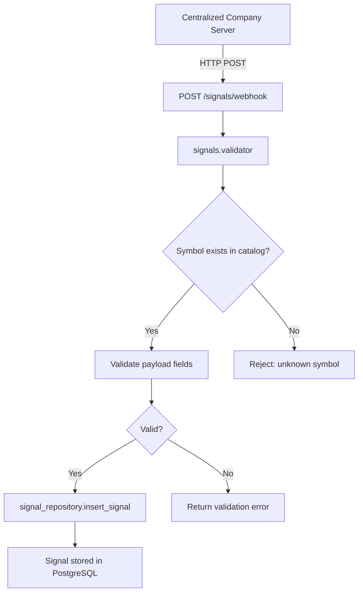
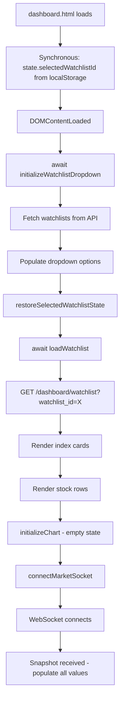

# PROJECT_STRUCTURE.md

> **Auto-generated architectural reference** for the Market Dashboard platform.
> This document is intended for AI assistants and developers to quickly understand the repository layout, module responsibilities, data flows, and business rules.

---

## 1. Repository Tree

```text
e:/Internship/
├── .env                          # Environment variables (DB connection, secrets)
├── .gitignore
│
├── Backend/
│   ├── main.py                   # FastAPI application entry point & startup hooks
│   ├── universe_cache.json       # Symbol → token/exchange mapping cache (auto-rebuilt)
│   │
│   ├── database/                 # Database access layer (repositories)
│   │   ├── db.py                 # SQLAlchemy engine, SessionLocal factory
│   │   ├── defaults.py           # DEFAULT_STOCKS list for fallback dashboard view
│   │   ├── instrument_repository.py   # Instruments CRUD, search, sync, dashboard queries
│   │   ├── signal_repository.py       # Signals table CRUD
│   │   ├── user_repository.py         # Users table CRUD, authentication helpers
│   │   └── watchlist_repository.py    # Watchlists + watchlist_items CRUD
│   │
│   ├── dependencies/             # FastAPI dependency injection
│   │   └── auth.py               # JWT token verification dependency
│   │
│   ├── market_data/              # Real-time market data engine
│   │   ├── connection.py         # KiteConnect client initialization & management
│   │   ├── kite_client.py        # KiteTicker WebSocket lifecycle & tick subscription
│   │   ├── subscriptions.py      # Subscription universe management
│   │   ├── tick_store.py         # In-memory latest-tick store & snapshot builder
│   │   ├── universe.py           # universe_cache.json read/write helpers
│   │   └── websocket_manager.py  # Browser WebSocket broadcast manager
│   │
│   ├── models/                   # SQLAlchemy ORM models
│   │   ├── broker_account.py     # BrokerAccount ORM model
│   │   └── user.py               # User ORM model
│   │
│   ├── routers/                  # FastAPI route handlers
│   │   ├── auth.py               # POST /auth/login, POST /auth/register
│   │   ├── broker.py             # Broker onboarding: /broker/status, /broker/callback
│   │   ├── candles.py            # GET /candles/{symbol} — historical OHLC data
│   │   ├── dashboard.py          # GET /dashboard/watchlist — dashboard data endpoint
│   │   ├── instruments.py        # Instruments CRUD, sync, search, bulk operations
│   │   ├── signals.py            # POST /signals/webhook, GET /signals/
│   │   ├── users.py              # User management (MASTER role only)
│   │   ├── watchlist.py          # Watchlists CRUD, add/remove items
│   │   └── ws.py                 # WebSocket endpoint /ws for browser clients
│   │
│   ├── schemas/                  # Pydantic request/response models
│   │   ├── auth.py               # Authentication validation schemas
│   │   ├── bootstrap.py          # Application bootstrap validation schemas
│   │   ├── broker.py             # Broker status & information validation schemas
│   │   ├── callback.py           # Broker OAuth callback schemas
│   │   ├── instrument_delete.py  # Instrument deletion schemas
│   │   ├── oauth.py              # OAuth authentication schemas
│   │   ├── user_management.py    # User administration validation schemas
│   │   └── watchlist.py          # Watchlist and items validation schemas
│   │
│   ├── security/                 # Authentication & encryption
│   │   ├── encryption.py         # Broker credentials encryption logic
│   │   ├── jwt_handler.py        # JWT encode/decode, token generation
│   │   └── password.py           # Password hashing logic
│   │
│   ├── services/                 # Business logic services
│   │   ├── auth_service.py       # Authentication business services
│   │   └── brokers/              # PLANNED: Multi-broker abstraction layer
│   │       ├── base.py           # BaseBroker abstract interface class
│   │       ├── factory.py        # Factory class to resolve active broker instance
│   │       ├── zerodha.py        # Zerodha integration module
│   │       ├── angelone.py       # Angel One integration module
│   │       └── upstox.py         # Upstox integration module
│   │
│   ├── signals/                  # Signal processing & validation pipeline
│   │   ├── constants.py          # Signal tracking state constants
│   │   ├── schemas.py            # Signal schema validation definitions
│   │   ├── tracker.py            # Lifecycle state machines tracker
│   │   └── validator.py          # Webhook payload & metadata validator
│   │
│   └── utils/                    # Shared utilities
│       └── logger.py             # Centralized logging configuration
│
└── Frontend/
    ├── index.html                # Entry redirect → pages/login.html
    │
    ├── css/
    │   └── pages/
    │       ├── bootstrap.css     # App bootstrap page styles
    │       ├── broker-auth.css   # Broker auth page styles
    │       ├── broker-callback.css # OAuth callback page styles
    │       ├── broker-connect.css # Broker connection setup styles
    │       ├── broker-setup.css  # Broker setup page styles
    │       ├── common.css        # Shared design system: tokens, typography, layout
    │       ├── dashboard.css     # Dashboard-specific styles
    │       ├── instrument-manager.css # Instrument manager views styles
    │       ├── instruments.css   # Legacy instrument table styles
    │       ├── login.css         # Login page styles
    │       ├── user-management.css # User management styles
    │       └── watchlists.css    # Watchlists page styles
    │
    ├── js/
    │   ├── api/
    │   │   └── api.js            # All backend API wrapper functions
    │   │
    │   ├── pages/
    │   │   ├── bootstrap.js      # App bootstrap page controller
    │   │   ├── broker-auth.js    # Broker OAuth initiation controller
    │   │   ├── broker-callback.js # Broker OAuth callback handler
    │   │   ├── broker-connect.js # Broker connection controller
    │   │   ├── broker-setup.js   # Broker setup coordinator controller
    │   │   ├── instrument-manager.js # Instrument manager page controller
    │   │   ├── login.js          # Login page controller
    │   │   ├── user-management.js # User management controller
    │   │   └── watchlists.js     # Watchlists page controller
    │   │
    │   ├── app.js                # Application bootstrap & global wiring
    │   ├── common.js             # Shared navigation handlers & theme toggle
    │   ├── dashboard.js          # Dashboard UI: indices, stocks, watchlist dropdown
    │   ├── chart.js              # TradingView Lightweight Charts integration
    │   ├── instruments.js        # Instrument Manager legacy view controller
    │   ├── websocket.js          # WebSocket connection, snapshot/update handlers
    │   └── lightweight-charts.js # TradingView Lightweight Charts library (vendored)
    │
    └── pages/
        ├── bootstrap.html        # App bootstrap page
        ├── broker-auth.html      # Broker authentication page
        ├── broker-callback.html  # OAuth callback landing page
        ├── broker-connect.html   # Broker connection page
        ├── broker-setup.html     # Broker setup landing page
        ├── dashboard.html        # Main dashboard (indices, stocks, charts)
        ├── instrument-manager.html # Instrument catalog management
        ├── login.html            # User authentication page
        ├── user-management.html  # User administration (MASTER role)
        └── watchlists.html       # Watchlist management page
```

---

## 2. Directory Responsibilities

### `Backend/database/`

Responsible for:
- PostgreSQL connection management via SQLAlchemy (`db.py`)
- Table schema initialization (CREATE TABLE IF NOT EXISTS)
- All SQL query execution through repository pattern
- Default fallback stock symbols (`defaults.py`)

### `Backend/routers/`

Responsible for:
- FastAPI route definitions and HTTP endpoint handlers
- Request validation via Pydantic schemas
- Delegating business logic to repositories and services
- WebSocket endpoint for real-time browser connections

### `Backend/market_data/`

Responsible for:
- KiteConnect API client management
- KiteTicker WebSocket connection for live market data
- Subscription universe computation (indices + default stocks + watchlist instruments)
- Tick normalization and in-memory storage
- Broadcasting ticks to connected browser clients
- Universe cache file management

### `Backend/signals/`

Responsible for:
- Webhook signals ingestion schemas (`schemas.py`)
- Inbound payload validation against catalog (`validator.py`)
- Signal tracking state constants (`constants.py`)
- Lifecycle tracking machines (`tracker.py`)
- Signal persistence to database

### `Backend/services/`

Responsible for:
- Business logic service classes
- Authentication services (`auth_service.py`)

### `Backend/services/brokers/ (PLANNED)`

Responsible for:
- Defining the multi-broker integration layer (`base.py`)
- Resolving the user-selected active broker instance via a registry factory (`factory.py`)
- Standardizing OAuth flow, instrument syncing, live market feeds, and execution methods across multiple brokers (Zerodha, Angel One, Upstox, etc.)

### `Backend/security/`

Responsible for:
- JWT token generation and verification
- Fernet-based broker credentials encryption/decryption
- Password hashing (bcrypt)

### `Backend/schemas/`

Responsible for:
- Pydantic models for API request/response validation
- Type-safe data transfer objects

### `Backend/dependencies/`

Responsible for:
- FastAPI dependency injection for authentication
- Extracting and validating JWT from request headers

### `Backend/utils/`

Responsible for:
- Centralized logging configuration
- Shared utility functions

### `Frontend/pages/`

Responsible for:
- HTML page templates for each application view
- Script loading order definitions
- DOM structure and semantic layout

### `Frontend/js/`

Responsible for:
- Client-side application logic
- API communication layer
- Real-time WebSocket message handling
- Chart rendering with TradingView Lightweight Charts
- Page-specific controllers and event handlers

### `Frontend/css/`

Responsible for:
- Design system tokens (colors, spacing, typography, borders)
- Page-specific styling
- Responsive layout rules
- Dark/light theme support

---

## 3. Backend Module Breakdown

### `main.py`

**Purpose**: FastAPI application entry point. Configures CORS, registers routers, initializes database schemas, and loads the subscription universe at startup.

**Startup Sequence**:
1. Initialize database schemas (signals, instruments, watchlists, users)
2. Load subscription universe from PostgreSQL into RAM
3. Load universe cache (`universe_cache.json`)
4. Market data service starts dynamically upon broker callback verification

**Router Registrations**:
- `/auth` — Authentication
- `/instruments` — Instrument catalog management
- `/signals` — Webhooks Ingestion & Signals management
- `/broker` — Broker onboarding
- `/candles` — Historical OHLC data
- `/dashboard` — Dashboard data endpoint
- `/watchlists` — Watchlist management
- `/users` — User administration
- `/ws` — WebSocket endpoint

---

### `database/db.py`

**Purpose**: SQLAlchemy engine factory and session management.

**Key Exports**:
- `engine` — SQLAlchemy engine connected to PostgreSQL
- `SessionLocal` — Scoped session factory

**Dependencies**: Reads `DATABASE_URL` from environment variables.

---

### `database/defaults.py`

**Purpose**: Defines the `DEFAULT_STOCKS` list used for fallback dashboard rendering when no watchlist is selected.

**Key Exports**:
- `DEFAULT_STOCKS: List[str]` — Priority-ordered list of default stock symbols

---

### `database/instrument_repository.py`

**Purpose**: Complete data access layer for the `instruments` table.

**Key Functions**:
| Function | Purpose |
|---|---|
| `init_db()` | CREATE TABLE IF NOT EXISTS for instruments |
| `get_all_instruments()` | Fetch all instruments from catalog |
| `create_instrument()` | Insert a single instrument |
| `delete_instrument()` | DELETE FROM instruments (true deletion) |
| `delete_instruments_bulk()` | Bulk delete by IDs |
| `delete_all_instruments()` | Clear entire catalog |
| `check_duplicate()` | Check UNIQUE(symbol, exchange) constraint |
| `search_instruments()` | Full-text search with ranking |
| `upsert_instruments_bulk()` | Bulk upsert from Zerodha sync |
| `get_dashboard_watchlist()` | Dashboard data: indices + stocks + view_mode |
| `get_instrument_by_symbol()` | Lookup by symbol |
| `get_instrument_by_symbol_exchange()` | Lookup by symbol + exchange |

**Tables Managed**: `instruments`

---

### `database/signal_repository.py`

**Purpose**: Data access layer for the `signals` table.

**Key Functions**:
| Function | Purpose |
|---|---|
| `init_db()` | CREATE TABLE IF NOT EXISTS for signals |
| `insert_signal()` | Store a validated signal |
| `get_signals()` | Fetch signals with pagination/filtering |

**Tables Managed**: `signals`

---

### `database/user_repository.py`

**Purpose**: Data access layer for the `users` table.

**Key Functions**:
| Function | Purpose |
|---|---|
| `init_db()` | CREATE TABLE IF NOT EXISTS for users |
| `create_user()` | Register a new user |
| `get_user_by_username()` | Lookup for authentication |
| `get_all_users()` | Admin listing |
| `update_user()` | Modify user details |
| `delete_user()` | Remove a user |

**Tables Managed**: `users`

---

### `database/watchlist_repository.py`

**Purpose**: Data access layer for `watchlists` and `watchlist_items` tables.

**Key Functions**:
| Function | Purpose |
|---|---|
| `init_db()` | CREATE TABLE IF NOT EXISTS for watchlists + watchlist_items |
| `create_watchlist()` | Create a named watchlist |
| `get_all_watchlists()` | List all watchlists |
| `get_watchlist_by_id()` | Fetch single watchlist with items |
| `update_watchlist()` | Rename a watchlist |
| `delete_watchlist()` | Delete a watchlist (CASCADE to items) |
| `add_instrument_to_watchlist()` | Add instrument to a watchlist |
| `remove_instrument_from_watchlist()` | Remove instrument from a watchlist |

**Tables Managed**: `watchlists`, `watchlist_items`

**Cascade Rule**: `FOREIGN KEY (instrument_id) REFERENCES instruments(id) ON DELETE CASCADE`

---

### `market_data/subscriptions.py`

**Purpose**: Manages the subscription universe — the set of instruments subscribed to Zerodha KiteTicker for live data.

**Subscription Universe** = Union of:
1. Hardcoded dashboard indices: `NIFTY50`, `BANKNIFTY`, `SENSEX`
2. Default fallback stocks from `DEFAULT_STOCKS`
3. All instruments present in any user watchlist (Note: Watchlist-driven subscriptions are *temporarily disabled / planned for reintroduction* during the multi-broker configuration updates; current subscriptions rely primarily on hardcoded indices and default instruments).

**Key Functions**:
| Function | Purpose |
|---|---|
| `reload_instruments()` | Rebuild subscription cache from database |
| `load_instruments()` | Startup loader (reload + rebuild universe cache) |
| `get_tokens()` | Return list of subscribed instrument tokens |
| `get_symbol(token)` | Reverse lookup: token → symbol |
| `get_instrument_metadata(token)` | Full metadata by token |
| `get_all_instruments()` | All subscribed instrument metadata |
| `rebuild_universe_cache()` | Regenerate universe_cache.json |

**Thread Safety**: All cache access protected by `threading.Lock`.

---

### `market_data/connection.py`

**Purpose**: Manages the centralized KiteConnect client instance.

**Key Functions**:
| Function | Purpose |
|---|---|
| `initialize_kite()` | Create KiteConnect with API key + access token |
| `get_kite()` | Retrieve the initialized client |

---

### `market_data/kite_client.py`

**Purpose**: KiteTicker WebSocket lifecycle management.

**Key Functions**:
| Function | Purpose |
|---|---|
| `start_ticker()` | Connect to KiteTicker and begin receiving ticks |
| `update_subscriptions()` | Subscribe/resubscribe to current token set |
| `on_ticks()` | Callback: normalize ticks → store → broadcast |

---

### `market_data/tick_store.py`

**Purpose**: In-memory latest-tick store.

**Key Functions**:
| Function | Purpose |
|---|---|
| `update_tick()` | Store/update the latest tick for a symbol |
| `get_snapshot()` | Return all latest ticks as a dictionary |

---

### `market_data/websocket_manager.py`

**Purpose**: Manages browser WebSocket connections and broadcasts.

**Key Functions**:
| Function | Purpose |
|---|---|
| `connect()` | Register a new browser client |
| `disconnect()` | Remove a browser client |
| `broadcast()` | Send tick data to all connected clients |

---

### `market_data/universe.py`

**Purpose**: Read/write helpers for `universe_cache.json`.

**Key Functions**:
| Function | Purpose |
|---|---|
| `load_universe_cache()` | Read cache from disk into memory |
| `save_universe_cache()` | Write mapping to disk |
| `get_universe_cache()` | Return in-memory cache |

---

### `routers/auth.py`

**Endpoints**:
| Method | Path | Purpose |
|---|---|---|
| POST | `/auth/login` | Authenticate user, return JWT |
| POST | `/auth/register` | Create new user account |

---

### `routers/broker.py`

**Endpoints**:
| Method | Path | Purpose |
|---|---|---|
| GET | `/broker/status` | Check broker connection status |
| GET | `/broker/callback` | Handle Zerodha OAuth callback |

---

### `routers/candles.py`

**Endpoints**:
| Method | Path | Purpose |
|---|---|---|
| GET | `/candles/{symbol}` | Fetch historical OHLC candle data |

---

### `routers/dashboard.py`

**Endpoints**:
| Method | Path | Purpose |
|---|---|---|
| GET | `/dashboard/watchlist` | Dashboard data (indices + stocks + view_mode) |

**Query Parameters**: `watchlist_id` (optional) — if provided, returns that watchlist's instruments; otherwise returns default market view.

---

### `routers/instruments.py`

**Endpoints**:
| Method | Path | Purpose |
|---|---|---|
| GET | `/instruments/` | List all instruments |
| POST | `/instruments/` | Add a single instrument |
| DELETE | `/instruments/{symbol}` | Delete an instrument |
| POST | `/instruments/delete-bulk` | Bulk delete instruments |
| POST | `/instruments/sync` | Sync from Zerodha master list |
| GET | `/instruments/search` | Search instruments |
| DELETE | `/instruments/clear-all` | Clear entire catalog |

---

### `routers/signals.py`

**Endpoints**:
| Method | Path | Purpose |
|---|---|---|
| POST | `/signals/webhook` | Receive TradingView webhook |
| GET | `/signals/` | List stored signals |

---

### `routers/watchlist.py`

**Endpoints**:
| Method | Path | Purpose |
|---|---|---|
| GET | `/watchlists/` | List all watchlists |
| POST | `/watchlists/` | Create a watchlist |
| GET | `/watchlists/{id}` | Get watchlist with items |
| PUT | `/watchlists/{id}` | Rename a watchlist |
| DELETE | `/watchlists/{id}` | Delete a watchlist |
| POST | `/watchlists/{id}/items` | Add instrument to watchlist |
| DELETE | `/watchlists/{id}/items/{instrument_id}` | Remove instrument |

**Side Effects**: Adding/removing items triggers `reload_instruments()` + `update_subscriptions()` to refresh the live ticker subscription set.

---

### `routers/users.py`

**Endpoints**:
| Method | Path | Purpose |
|---|---|---|
| GET | `/users/` | List all users (MASTER only) |
| POST | `/users/` | Create a user (MASTER only) |
| PUT | `/users/{id}` | Update a user (MASTER only) |
| DELETE | `/users/{id}` | Delete a user (MASTER only) |

---

### `routers/ws.py`

**Endpoints**:
| Method | Path | Purpose |
|---|---|---|
| WebSocket | `/ws` | Real-time market data stream to browser |

**Protocol**: On connect, sends a `snapshot` message with all latest ticks. Subsequently sends `update` messages for each new tick.

---

### `services/auth_service.py`

**Purpose**: Implements core business logic for user creation, logins, and authentication tokens.

---

### `security/jwt_handler.py`

**Purpose**: JWT token lifecycle.

**Key Functions**:
| Function | Purpose |
|---|---|
| `create_access_token()` | Generate JWT with user claims |
| `verify_token()` | Decode and validate JWT |

---

## 4. Frontend Module Breakdown

### Pages

| Page | File | Purpose |
|---|---|---|
| Login | `login.html` | User authentication (username + password) |
| Bootstrap | `bootstrap.html` | Application system health configuration / initial setups |
| Broker Setup | `broker-setup.html` | Broker configuration management landing page |
| Broker Auth | `broker-auth.html` | Initiates individual selected broker OAuth request |
| Broker Connect | `broker-connect.html` | Manual credential configurations for alternative brokers |
| Broker Callback | `broker-callback.html` | OAuth callback landing page |
| Dashboard | `dashboard.html` | Main view: indices, stocks, charts, watchlist selector |
| Instrument Manager | `instrument-manager.html` | Instrument catalog CRUD & synchronization management |
| Watchlists | `watchlists.html` | Watchlist creation, deletion, item management |
| User Management | `user-management.html` | Admin user CRUD (MASTER role only) |

### Navigation Flow

```text
login.html
  → (on success) bootstrap.html (resolves startup configuration)
    → broker-setup.html
      → (Select Active Broker Type) 
        → broker-auth.html (OAuth brokers, redirects to provider)
          → broker-callback.html (verifies token) → dashboard.html
        → broker-connect.html (Manual API config) → dashboard.html

dashboard.html ↔ instrument-manager.html ↔ watchlists.html ↔ user-management.html
(full page navigation via window.location.replace)
```

### JavaScript Modules

#### `js/api/api.js`
All backend API communication functions. Every fetch call to the backend goes through this module.

#### `js/common.js`
Shared navigation handlers, logout, and active nav highlights.

#### `js/dashboard.js`
Dashboard UI controller. Populates dropdowns, renders tables, computes metrics, and synchronizes selection states.

#### `js/chart.js`
TradingView Lightweight Charts integration wrapper. Initial empty states, updates candles live, clears state.

#### `js/instruments.js`
Legacy instruments table event controller.

#### `js/websocket.js`
WebSocket interface. Decoupled update delivery to multiple components.

#### `js/app.js`
Application bootstrap. Wired to setup chart canvas and connection manager.

#### `js/pages/bootstrap.js`
Performs checking of system readiness on bootstrap sequence.

#### `js/pages/broker-auth.js`
Fires routing to initiate OAuth flow redirects.

#### `js/pages/broker-callback.js`
Reads OAuth callback request tokens and authenticates broker.

#### `js/pages/broker-connect.js`
Handles manual connection forms.

#### `js/pages/broker-setup.js`
Broker setup selection views layout logic.

#### `js/pages/instrument-manager.js`
Main Instrument Manager table search, pagination, dynamic sync, and bulk deletions actions.

#### `js/pages/watchlists.js`
Watchlist configurations.

#### `js/pages/user-management.js`
User administration.

---

## 5. Request Flow Diagrams

### Authentication Flow



### Market Data Flow



### Subscription Universe Flow



### Signal / Webhook Flow



### Dashboard Initialization Flow



---

## 6. Database Access Layer

### Tables and Repositories

| Repository File | Table(s) Managed | Key Constraints |
|---|---|---|
| `user_repository.py` | `users` | `UNIQUE(username)` |
| `instrument_repository.py` | `instruments` | `UNIQUE(symbol, exchange)`, `UNIQUE(token)` |
| `signal_repository.py` | `signals` | FK → instruments |
| `watchlist_repository.py` | `watchlists`, `watchlist_items` | `watchlist_items.instrument_id` FK → `instruments(id) ON DELETE CASCADE` |

### Instruments Table Schema

```sql
CREATE TABLE IF NOT EXISTS instruments (
    id              SERIAL PRIMARY KEY,
    symbol          VARCHAR(50) NOT NULL,
    token           INTEGER NOT NULL UNIQUE,
    exchange        VARCHAR(20) NOT NULL,
    name            VARCHAR(255),
    segment         VARCHAR(50),
    broker          VARCHAR(50),
    instrument_category VARCHAR(50) DEFAULT 'STOCK',
    created_at      TIMESTAMP DEFAULT CURRENT_TIMESTAMP,
    updated_at      TIMESTAMP DEFAULT CURRENT_TIMESTAMP,
    UNIQUE(symbol, exchange)
);
```

### Watchlist Tables Schema

```sql
CREATE TABLE IF NOT EXISTS watchlists (
    id          SERIAL PRIMARY KEY,
    name        VARCHAR(100) NOT NULL UNIQUE,
    created_at  TIMESTAMP DEFAULT CURRENT_TIMESTAMP,
    updated_at  TIMESTAMP DEFAULT CURRENT_TIMESTAMP
);

CREATE TABLE IF NOT EXISTS watchlist_items (
    id              SERIAL PRIMARY KEY,
    watchlist_id    INTEGER NOT NULL REFERENCES watchlists(id) ON DELETE CASCADE,
    instrument_id   INTEGER NOT NULL REFERENCES instruments(id) ON DELETE CASCADE,
    added_at        TIMESTAMP DEFAULT CURRENT_TIMESTAMP,
    UNIQUE(watchlist_id, instrument_id)
);
```

### Deletion Semantics

- **Instruments**: True database deletion (`DELETE FROM instruments`). No soft-delete.
- **Watchlist Items**: Automatically cascade-deleted when the parent instrument is deleted.
- **Watchlists**: Deleting a watchlist cascade-deletes all its items.

---

## 7. Current Architectural Constraints

### Authentication
- JWT-based authentication with tokens stored in browser `localStorage`
- Passwords hashed with bcrypt
- User roles: `MASTER` (admin) and standard users
- User management endpoints restricted to `MASTER` role

### Broker Integration
- Multiple broker connections per user are allowed (e.g., Zerodha, Angel One, Upstox, etc.)
- Business constraint: `UNIQUE(user_id, broker)` ensures at most one connection per broker type per user.
- A user cannot connect multiple accounts of the same broker type (e.g., two Zerodha accounts).
- Users select their **ACTIVE BROKER** during the login/session sequence.
- A user session operates against exactly one active broker at a time. The selected active broker dynamically determines the dashboard data, active instrument universe, market data feeds, and future trade execution routing.
- Changing the active broker requires logout and re-authentication.
- OAuth2 flow is used for broker session authentication.
- Access token stored server-side after callback verification.

### Instrument Catalog
- `UNIQUE(symbol, exchange)` — prevents duplicate instruments
- `UNIQUE(token)` — ensures each Zerodha instrument token is unique
- True deletion semantics (no soft-delete `active` column)
- Cascade deletion propagates to `watchlist_items`

### Subscription Architecture
- Subscription universe = Hardcoded indices + Default stocks
- Only 3 indices auto-subscribed: `NIFTY50`, `BANKNIFTY`, `SENSEX`
- Watchlist-driven dynamic subscriptions are *temporarily disabled / planned for reintroduction*.
- Uniqueness enforced by instrument `token` (prevents duplicate subscriptions)

### Dashboard
- Indices always rendered regardless of selected watchlist
- Empty watchlist shows "no instruments" banner but preserves index cards
- WebSocket updates routed independently to index cards AND stock rows
- Watchlist selection persisted in `localStorage`
- Chart starts empty; loads only on explicit user click

---

## 8. Master-Client Architecture

The platform follows a decoupled **Master-Client** architecture to separate signal generation and analysis from client-side execution.

### MASTER SYSTEM (Implemented)
The current repository represents the **Master System**.
- **Responsibilities**:
  - Ingestion of company signals from a centralized company server through secure webhook ingestion.
  - Validation of ingested signals against the master instrument database.
  - Evaluation of core trade strategy logic.
  - Computation of price targets (Target 1, Target 2, Target 3).
  - Monitoring and updating signal life cycle statuses.
  - Broadcasting validated signals to all registered Client Systems.
  - User management, administrative tasks, and analytical dashboard visualization.
- **Constraints**: 
  - **MASTER SYSTEM NEVER EXECUTES TRADES.** It focuses entirely on signal enrichment, life cycle management, and distribution.

### CLIENT SYSTEM (Planned / Not Yet Implemented)
A separate subsystem designed to run locally or under isolated client environments.
- **Responsibilities**:
  - Listening to real-time signal broadcasts from the Master System.
  - Execution of actual market orders via the client's configured active broker API.
  - Local portfolio tracking and position monitoring.
  - Independent risk management (e.g., stop-loss handling, position sizing).

---

## 9. Signal Lifecycle (Planned)

The Master System owns and manages the complete lifecycle state machine for generated trading signals. Client systems react to lifecycle updates but do not control or mutate these states.

The planned states include:
- `PENDING` - Signal received, awaiting initial trigger conditions
- `TRIGGERED` - Trigger conditions met, broadcast to clients
- `ACTIVE` - Entry price confirmed by market data
- `T1_HIT` - Target 1 price reached
- `T2_HIT` - Target 2 price reached
- `T3_HIT` - Target 3 price reached
- `SL_HIT` - Stop Loss hit
- `COMPLETED` - Signal workflow finished normally
- `CANCELLED` - Signal manually or algorithmically canceled before trigger
- `EXPIRED` - Signal valid window passed without execution

---

## 10. Implemented vs Planned

### ✅ IMPLEMENTED

| Feature | Status |
|---|---|
| User authentication (login/register) | Complete |
| JWT-based authorization | Complete |
| Zerodha Broker Integration | Complete |
| Real-time market data via KiteTicker | Complete |
| Market dashboard with live indices and stocks | Complete |
| Historical candlestick charts (TradingView) | Complete |
| Live candle updates on chart | Complete |
| Instrument catalog management (CRUD) | Complete |
| Instrument search with autocomplete | Complete |
| Bulk instrument operations (delete, sync) | Complete |
| Watchlist management (CRUD) | Complete |
| Dashboard ↔ Watchlist integration | Complete |
| TradingView webhook signal ingestion | Complete |
| Signal validation against instrument catalog | Complete |
| User management (MASTER role) | Complete |
| WebSocket real-time data broadcast | Complete |
| Universe cache for fast symbol lookups | Complete |

### 🔮 PLANNED

| Feature | Notes |
|---|---|
| Client application | Isolated frontend/backend container for client nodes |
| Signal distribution engine | Secure broadcast engine from Master to clients |
| Signal lifecycle tracker | Tracks execution states across clients |
| Multi-broker abstraction layer | Unified wrapper service (base.py, factory.py, zerodha.py, angelone.py, upstox.py) |
| Client trade execution engine | Local order management system (OMS) for clients |
| Risk management engine (Client) | client-side sizing, stop-loss, exposure checks |
| Portfolio tracking (Client) | Local P&L, holdings, and position viewer |
| Strategy backtesting | Historical data replay and strategy evaluation |
| Alert system | Custom price/indicator alerts |
| Watchlist-driven subscriptions | Re-enabling dynamic subscription rebuilds via user watchlists |

---

## 11. Integration Points

### Broker APIs (Zerodha / Multi-Broker)

**Purpose**: Broker authentication, historical OHLC data, instrument sync. Currently supports Zerodha KiteConnect, with plans to make the underlying interface broker-agnostic using the `services/brokers/` abstraction wrapper.

**Entry Points**:
- `Backend/market_data/connection.py` – Client initialization
- `Backend/routers/broker.py` — OAuth callback handling
- `Backend/routers/candles.py` — Historical OHLC data via `kite.historical_data()`
- `Backend/routers/instruments.py` — Instrument sync via `kite.instruments()`

### Zerodha KiteTicker WebSocket

**Purpose**: Real-time streaming market data (LTP, OHLC, depth, volume).

**Entry Points**:
- `Backend/market_data/kite_client.py` — Ticker connection lifecycle
- `Backend/market_data/subscriptions.py` — Token subscription management

### TradingView Webhooks

**Purpose**: Receive trading signals from a centralized company server.

**Entry Points**:
- `Backend/routers/signals.py` — `POST /signals/webhook`
- `Backend/signals/validator.py` — Payload validation

### PostgreSQL Database

**Purpose**: Persistent storage for all application data.

**Entry Points**:
- `Backend/database/db.py` — Engine and session configuration
- All `*_repository.py` files — Query execution

**Connection**: Via `DATABASE_URL` environment variable in `.env`.

### Browser WebSocket

**Purpose**: Real-time push of market data to the browser dashboard.

**Entry Points**:
- `Backend/routers/ws.py` — WebSocket endpoint `/ws`
- `Backend/market_data/websocket_manager.py` — Connection management and broadcast
- `Frontend/js/websocket.js` — Client-side connection and message handling

---

> **Last Updated**: 2026-07-01
> **Generated by**: Architectural analysis of the complete repository
