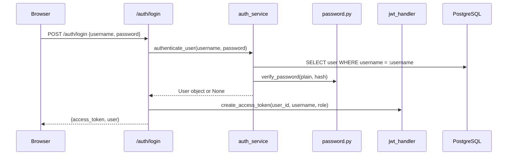
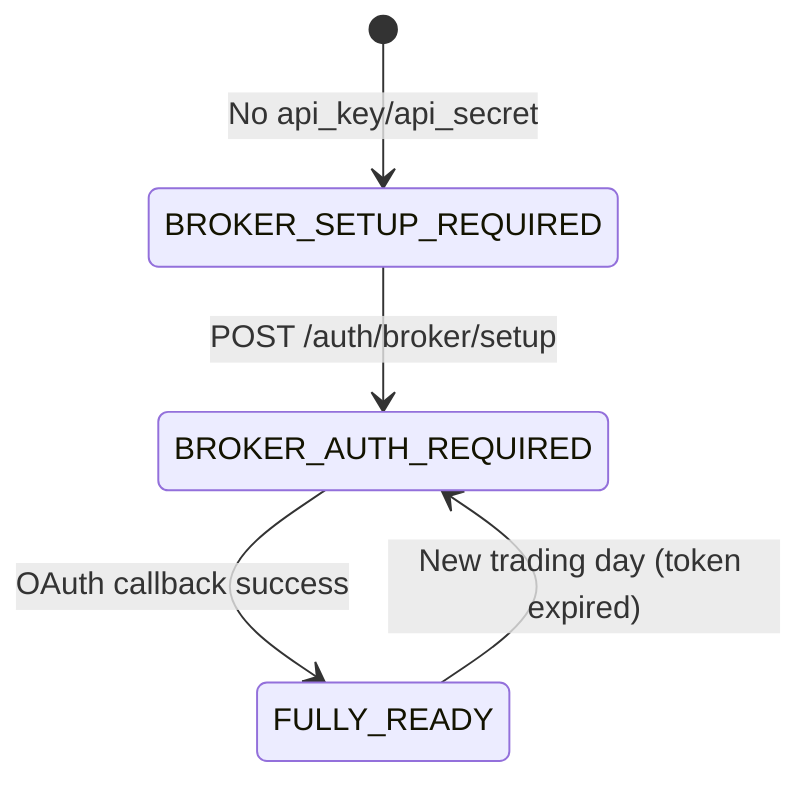
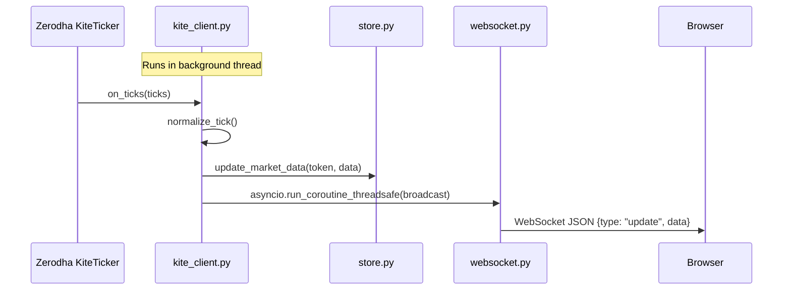
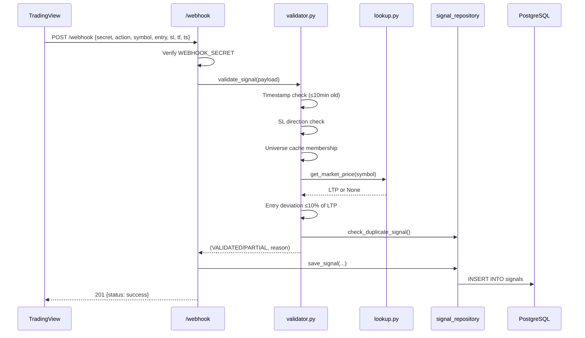

# Backend Architectural Reference

> Generated from live code analysis on 2026-07-02. Reflects only files currently on disk — no planned/future features.

---

## Repository Tree

```
Backend/
├── main.py                          # FastAPI app entrypoint, lifespan, router registration
├── test.py                          # Minimal test stub
├── universe_cache.json              # Persisted symbol→metadata JSON (~5.8 MB)
├── __init__.py
│
├── database/
│   ├── __init__.py
│   ├── db.py                        # SQLAlchemy engine, session factory, get_db dependency
│   ├── defaults.py                  # Hardcoded default stock/index symbol lists
│   ├── instrument_repository.py     # Raw SQL CRUD for instruments table
│   ├── signal_repository.py         # Raw SQL CRUD for signals table
│   └── watchlist_repository.py      # Raw SQL CRUD for watchlists + watchlist_items tables
│
├── dependencies/
│   └── auth.py                      # FastAPI Depends() for JWT→User resolution
│
├── market_data/
│   ├── __init__.py
│   ├── connection.py                # KiteConnect/KiteTicker singleton factory
│   ├── kite_client.py               # Market data service lifecycle (start/stop/restart)
│   ├── lookup.py                    # LTP price lookup with TTL cache + broker fallback
│   ├── store.py                     # In-memory thread-safe latest-tick store
│   ├── subscriptions.py             # Subscription universe builder (DB → RAM cache)
│   └── universe.py                  # universe_cache.json file I/O + in-memory symbol registry
│
├── models/
│   ├── __init__.py                  # Re-exports User, UserRole, BrokerAccount
│   ├── user.py                      # SQLAlchemy ORM: users table
│   └── broker_account.py            # SQLAlchemy ORM: broker_accounts table
│
├── routers/
│   ├── __init__.py
│   ├── auth.py                      # /auth/* – Login, bootstrap, broker setup/connect/callback
│   ├── candles.py                   # /candles/* – Historical OHLCV data
│   ├── dashboard.py                 # /dashboard/* – Dashboard watchlist data
│   ├── instruments.py               # /instruments/* – CRUD, search, sync, bulk-delete
│   ├── user_management.py           # /users/* – MASTER-only user CRUD
│   ├── watchlist.py                 # /watchlists/* – Watchlist + item CRUD
│   ├── webhook.py                   # /webhook – Signal ingestion
│   └── websocket.py                 # /ws – Real-time tick streaming to browser
│
├── schemas/
│   ├── auth.py                      # LoginRequest, LoginResponse, UserResponse
│   ├── bootstrap.py                 # BootstrapState enum, BootstrapResponse
│   ├── broker.py                    # BrokerSetupRequest/Response
│   ├── callback.py                  # BrokerCallbackRequest/Response
│   ├── instrument_delete.py         # BulkDeleteRequest
│   ├── oauth.py                     # BrokerConnectResponse
│   ├── user_management.py           # UserCreate/Update/PasswordReset/Status schemas
│   └── watchlist.py                 # Watchlist CRUD schemas
│
├── security/
│   ├── encryption.py                # Fernet encrypt/decrypt for broker secrets
│   ├── jwt_handler.py               # JWT create/decode using python-jose
│   └── password.py                  # bcrypt hash/verify using passlib
│
├── services/
│   └── auth_service.py              # authenticate_user() – DB lookup + password verify
│
├── signals/
│   ├── __init__.py
│   ├── constants.py                 # SignalStatus enum (PENDING, TRIGGERED, etc.)
│   ├── schemas.py                   # WebhookSignalRequest Pydantic model
│   ├── tracker.py                   # Placeholder SignalTracker class (unused)
│   └── validator.py                 # 7-layer signal validation pipeline
│
└── utils/
    ├── logger.py                    # Centralized logging (console + rotating file)
    └── logs/
        └── app.log                  # Application log file
```

---

## Layer Responsibilities

| Layer | Purpose |
|---|---|
| **`main.py`** | FastAPI app factory, lifespan startup/shutdown orchestration, CORS, router registration |
| **`routers/`** | HTTP/WebSocket endpoint definitions, request validation, response marshalling |
| **`schemas/`** | Pydantic request/response models with field validators |
| **`models/`** | SQLAlchemy ORM models for `users` and `broker_accounts` tables |
| **`database/`** | Raw SQL repositories for `instruments`, `signals`, `watchlists`, `watchlist_items` tables; engine/session factory |
| **`dependencies/`** | FastAPI `Depends()` injectable auth guard |
| **`services/`** | Business-level service functions (currently: auth only) |
| **`security/`** | Cryptographic primitives: Fernet encryption, JWT handling, bcrypt passwords |
| **`signals/`** | Webhook signal validation pipeline, Pydantic schemas, status constants |
| **`market_data/`** | Zerodha KiteConnect/KiteTicker integration, real-time tick processing, subscription management, in-memory stores |
| **`utils/`** | Centralized logging infrastructure |

---

## Per-File Analysis

---

### `main.py`

**Purpose:** Application entrypoint. Configures FastAPI with lifespan events, CORS middleware, and all router registrations.

**Key Responsibilities:**
- Loads `.env` from workspace root and Backend directory
- Initializes centralized logging via `setup_logging()`
- On startup: initializes DB schemas (signals, instruments, watchlists), loads subscription universe into RAM, loads universe cache from JSON
- On shutdown: stops the market data service (KiteTicker)
- Registers 8 API routers + root status/health endpoints

**Dependencies:** `fastapi`, `dotenv`, all routers, `models`, `database/*`, `market_data/*`, `utils/logger`

**Consumers:** Uvicorn ASGI server

---

### `database/db.py`

**Purpose:** Creates the SQLAlchemy engine, session factory, and declarative base from PostgreSQL env vars.

**Key Responsibilities:**
- Reads `DB_USER`, `DB_PASSWORD`, `DB_HOST`, `DB_PORT`, `DB_NAME` from environment
- Creates `engine` with `pool_pre_ping=True` for connection health checks
- Exports `SessionLocal` factory and `Base` declarative base
- Provides `get_db()` dependency generator

**Dependencies:** `sqlalchemy`, `dotenv`, `utils/logger`

**Consumers:** Every repository module, `dependencies/auth.py`, `routers/auth.py`, `routers/user_management.py`, `services/auth_service.py`

---

### `database/defaults.py`

**Purpose:** Single source of truth for hardcoded default stock/index symbol lists.

**Key Responsibilities:**
- Defines `DEFAULT_STOCKS` (10 blue-chip equities, ordered by priority)
- Defines `DEFAULT_INDICES` (NIFTY 50, NIFTY BANK, SENSEX)
- Defines `DEFAULT_SYMBOLS` set (union of stocks + indices, uppercase, for fast lookup)

**Consumers:** `instrument_repository.py` (dashboard fallback), `subscriptions.py` (subscription universe)

---

### `database/instrument_repository.py`

**Purpose:** Complete CRUD and search operations for the `instruments` table using raw SQL.

**Key Responsibilities:**
- `init_db()` — CREATE TABLE IF NOT EXISTS + column migration for `instrument_category`
- `get_all_instruments()` — Full table scan ordered by symbol
- `search_instruments()` — Multi-field search with relevance ranking (exact > starts-with > contains)
- `create_instrument()` — INSERT with ON CONFLICT upsert on `(symbol, exchange)`
- `delete_instrument()` / `delete_instruments_bulk()` / `delete_all_instruments()` — Single, bulk, and full table deletes
- `upsert_instruments_bulk()` — Batch upsert with token recycling conflict resolution
- `check_duplicate()` — Existence check by symbol+exchange or token
- `get_dashboard_watchlist()` — Composite dashboard query: indices + stocks from watchlist or default fallback
- `get_instrument_by_symbol()` / `get_instrument_by_symbol_exchange()` — Single record lookups

**Dependencies:** `sqlalchemy`, `database/db`, `database/defaults`, `utils/logger`

**Consumers:** `routers/instruments.py`, `routers/dashboard.py`, `market_data/subscriptions.py`

---

### `database/signal_repository.py`

**Purpose:** CRUD operations for the `signals` table.

**Key Responsibilities:**
- `init_db()` — CREATE TABLE IF NOT EXISTS for signals schema
- `save_signal()` — Inserts a validated signal with lifecycle states (status, validation_status, validation_reason)
- `check_duplicate_signal()` — Detects duplicate signals (same symbol+action+entry within 2 minutes)

**Dependencies:** `sqlalchemy`, `database/db`, `utils/logger`

**Consumers:** `routers/webhook.py`, `signals/validator.py`

---

### `database/watchlist_repository.py`

**Purpose:** Full CRUD for `watchlists` and `watchlist_items` tables.

**Key Responsibilities:**
- `init_db()` — Creates both tables with FK cascade and uniqueness constraint
- CRUD: `get_all_watchlists()`, `get_watchlist_by_id()`, `create_watchlist()`, `rename_watchlist()`, `delete_watchlist()`
- Items: `get_watchlist_items()`, `add_instrument_to_watchlist()`, `remove_instrument_from_watchlist()`
- Guards: `get_watchlist_items_count()`, `check_instrument_in_watchlist()`

**Dependencies:** `sqlalchemy`, `database/db`, `utils/logger`

**Consumers:** `routers/watchlist.py`, `market_data/subscriptions.py` (via JOIN query)

---

### `dependencies/auth.py`

**Purpose:** FastAPI injectable dependency that extracts Bearer JWT, decodes it, and returns the authenticated `User` ORM instance.

**Key Responsibilities:**
- Configures `OAuth2PasswordBearer` scheme pointing to `/auth/login`
- Decodes JWT, extracts `sub` claim (user_id)
- Queries DB for user, verifies `is_active` status
- Raises 401 on any failure

**Dependencies:** `fastapi`, `jose`, `database/db`, `models/user`, `security/jwt_handler`

**Consumers:** `routers/auth.py` (get_me, bootstrap, broker endpoints), `routers/user_management.py`

---

### `market_data/connection.py`

**Purpose:** Thread-safe singleton factory for KiteConnect (REST API client) and KiteTicker (WebSocket client).

**Key Responsibilities:**
- `get_kite()` — Returns cached KiteConnect instance or raises `MissingCredentialsError`
- `create_kite_client(api_key, access_token)` — Initializes and caches the KiteConnect singleton
- `create_kws(api_key, access_token)` — Creates a new (unconnected) KiteTicker instance
- `reset_connection_state()` — Clears the cached KiteConnect singleton

**Dependencies:** `threading`, `kiteconnect`, `utils/logger`

**Consumers:** `market_data/kite_client.py`, `market_data/lookup.py`, `routers/candles.py`, `routers/instruments.py`

---

### `market_data/kite_client.py`

**Purpose:** Manages the full lifecycle of the Zerodha KiteTicker WebSocket service (start, stop, restart, dynamic subscription updates).

**Key Responsibilities:**
- `start_market_data_service(loop, api_key, access_token)` — Creates KiteTicker, registers callbacks, connects in background thread
- `stop_market_data_service()` — Closes WebSocket, clears state, cancels periodic task
- `restart_market_data_service()` — Stop + Start
- `update_subscriptions()` — Differential subscribe/unsubscribe based on DB cache changes
- `on_connect()` — Subscribes to all tokens in FULL mode on connection
- `on_ticks()` — Normalizes ticks, stores in memory, schedules async broadcast to frontend clients
- `normalize_tick()` — Converts raw Zerodha tick dict to standardized application format (handles indices vs equities)
- Periodic logging task every 60 seconds

**Threading Model:** KiteTicker runs in a background daemon thread. Tick callbacks use `asyncio.run_coroutine_threadsafe()` to bridge into the main FastAPI event loop.

**Dependencies:** `asyncio`, `threading`, `kiteconnect`, `market_data/connection`, `market_data/subscriptions`, `market_data/store`, `routers/websocket`

**Consumers:** `routers/auth.py` (broker callback/bootstrap), `routers/instruments.py` (subscription updates), `routers/watchlist.py` (subscription updates)

**External Integration:** Zerodha KiteTicker WebSocket API

---

### `market_data/store.py`

**Purpose:** Thread-safe in-memory store for the latest normalized tick data per instrument token.

**Key Responsibilities:**
- `update_market_data(token, data)` — Writes latest tick (uses `deepcopy`)
- `get_market_data()` — Returns full snapshot of all instruments
- `get_symbol_data(symbol)` — Single symbol lookup (prefers NSE exchange)
- `get_symbol_exchange_data(symbol, exchange)` — Exact symbol+exchange lookup

**Dependencies:** `threading`, `copy`

**Consumers:** `market_data/kite_client.py` (on_ticks), `market_data/lookup.py`, `routers/websocket.py` (initial snapshot)

---

### `market_data/subscriptions.py`

**Purpose:** Builds and maintains the subscription universe — the union of instruments that should receive live tick data.

**Key Responsibilities:**
- `reload_instruments()` — Queries DB for union of: hardcoded indices + default stocks + all watchlist items. Builds three thread-safe RAM caches: `_TOKEN_TO_SYMBOL`, `_SYMBOL_TO_METADATA`, `_TOKEN_TO_METADATA`
- `rebuild_universe_cache()` — Persists full instruments DB to `universe_cache.json`
- `load_instruments()` — Called once at startup
- `get_tokens()` — Returns list of integer tokens for KiteTicker subscription
- `get_symbol(token)` — Reverse lookup: token → symbol
- `get_instrument_metadata(token)` — Full metadata by token
- `get_all_instruments()` — All cached instrument metadata

**Dependencies:** `threading`, `sqlalchemy`, `database/db`, `database/defaults`, `database/instrument_repository`, `market_data/universe`

**Consumers:** `market_data/kite_client.py`, `routers/candles.py`, `routers/instruments.py`, `routers/watchlist.py`

---

### `market_data/lookup.py`

**Purpose:** Authoritative LTP (Last Traded Price) resolution with 3-tier lookup strategy.

**Key Responsibilities:**
- `get_market_price(symbol)` — Returns LTP using:
  1. Live in-memory store (fast path)
  2. Local TTL cache (30-second window)
  3. Zerodha REST API `kite.ltp()` (dynamic query)
- Raises `BrokerUnavailableException` on broker errors

**Dependencies:** `market_data/connection`, `market_data/store`, `market_data/universe`

**Consumers:** `signals/validator.py` (market price validation layer)

---

### `market_data/universe.py`

**Purpose:** Manages the persistent `universe_cache.json` file and in-memory symbol→exchange+token registry.

**Key Responsibilities:**
- `load_universe_cache()` — Reads JSON file into `_UNIVERSE_CACHE` dict at startup
- `save_universe_cache(symbols)` — Writes dict/list to JSON and updates memory
- `get_symbol_exchange(symbol)` — Returns exchange for symbol (defaults NSE, with NFO suffix detection)
- `get_instrument_token(symbol)` — Returns numerical token from cache
- `is_symbol_in_universe(symbol)` — O(1) membership check (bypasses in fallback mode when cache is empty)
- `symbol_exists(symbol)` — Simple cache key check

**Dependencies:** `os`, `json`, `utils/logger`

**Consumers:** `signals/validator.py`, `market_data/lookup.py`, `market_data/subscriptions.py`, `routers/instruments.py`

---

### `models/user.py`

**Purpose:** SQLAlchemy ORM model for the `users` table.

**Fields:** `id`, `username` (unique), `email` (unique), `password_hash`, `role` (MASTER/CLIENT enum), `fullname`, `is_active`, `created_at`, `updated_at`

**Relationships:** One-to-one with `BrokerAccount` (cascade delete)

**Consumers:** `dependencies/auth.py`, `services/auth_service.py`, `routers/auth.py`, `routers/user_management.py`

---

### `models/broker_account.py`

**Purpose:** SQLAlchemy ORM model for the `broker_accounts` table.

**Fields:** `id`, `user_id` (FK → users, unique), `account_name`, `api_key` (encrypted), `api_secret` (encrypted), `access_token` (encrypted), `last_login_trading_day`, `is_connected`, `zerodha_user_name`, `broker_user_id`, `oauth_state`, `oauth_state_created_at`, `created_at`, `updated_at`

**Relationships:** Many-to-one back to `User`

**Consumers:** `routers/auth.py` (all broker endpoints)

---

### `routers/auth.py`

**Purpose:** Authentication, broker onboarding, and OAuth callback handling.

| Endpoint | Method | Auth | Purpose |
|---|---|---|---|
| `/auth/login` | POST | None | Authenticate credentials → JWT |
| `/auth/me` | GET | Bearer | Return current user profile |
| `/auth/bootstrap` | GET | Bearer | Evaluate onboarding state machine |
| `/auth/broker/setup` | POST | Bearer | Save encrypted API key/secret |
| `/auth/broker/connect` | GET | Bearer | Generate Zerodha OAuth redirect URL |
| `/auth/broker/callback` | POST | Bearer | Exchange request_token → access_token, start market data service |

**Business Rules:**
- OAuth state token expires after 10 minutes
- Duplicate Zerodha account connection across platform users is rejected (deletes the entire BrokerAccount row)
- Bootstrap auto-starts market service if token is valid for today but service isn't running
- Last login trading day is compared in IST timezone

**External Integration:** Zerodha KiteConnect OAuth + `kite.generate_session()`

---

### `routers/candles.py`

**Purpose:** Serves historical OHLCV candlestick data from Zerodha.

| Endpoint | Method | Auth | Purpose |
|---|---|---|---|
| `/candles/{symbol}` | GET | None | Fetch historical candles by symbol |

**Business Rules:**
- Validates interval against whitelist: `minute`, `3minute`, `5minute`, `10minute`, `15minute`, `30minute`, `60minute`, `day`
- Limit capped between 1–1000
- Lookback periods are interval-dependent (7 days for minute, 180 for day)
- Retry once on timeout/connection error

**External Integration:** Zerodha `kite.historical_data()`

---

### `routers/dashboard.py`

**Purpose:** Returns the dashboard's composite instrument list (indices + stocks).

| Endpoint | Method | Auth | Purpose |
|---|---|---|---|
| `/dashboard/watchlist` | GET | None | Dashboard instruments with fallback logic |

**View Modes:** `"fallback"` (default stocks), `"watchlist"` (selected watchlist items), `"empty"` (no data)

---

### `routers/instruments.py`

**Purpose:** Full instrument catalog management.

| Endpoint | Method | Auth | Purpose |
|---|---|---|---|
| `/instruments` | GET | None | List all instruments |
| `/instruments` | POST | None | Add single instrument (with broker validation) |
| `/instruments/{symbol}` | DELETE | None | Delete single instrument |
| `/instruments/search` | GET | None | Search instruments by query |
| `/instruments/all` | DELETE | None | Delete ALL instruments |
| `/instruments/bulk-delete` | POST | None | Bulk delete selected instruments |
| `/instruments/sync` | POST | None | Sync from Zerodha master list |

**Business Rules:**
- Add Instrument validates against Zerodha master list: token, symbol, exchange, segment, name, live LTP must all match
- Symbol uniqueness enforced across all exchanges
- Sync uses daily-expiring in-memory cache for exchange instruments
- Segment/category normalization: INDICES→(IND, INDEX), EQ→(EQ, STOCK), FUT→(FUT, FUTURE), OPT→(OPT, OPTION), ETF→(ETF, ETF)
- After add/delete/sync, subscription universe + KiteTicker subscriptions are refreshed

**External Integration:** Zerodha `kite.instruments()`, `kite.ltp()`

---

### `routers/user_management.py`

**Purpose:** MASTER-only user administration.

| Endpoint | Method | Auth | Purpose |
|---|---|---|---|
| `/users` | POST | MASTER | Create new user |
| `/users` | GET | MASTER | List all users |
| `/users/{user_id}/status` | PATCH | MASTER | Enable/disable user |
| `/users/{user_id}` | PATCH | MASTER | Edit fullname, email, role |
| `/users/{user_id}/password` | PATCH | MASTER | Reset password |

**Business Rules:**
- All endpoints require MASTER role (403 if CLIENT)
- Users cannot disable their own account
- Username and email uniqueness enforced
- Password complexity: 8+ chars, upper+lower+digit+special

---

### `routers/watchlist.py`

**Purpose:** Watchlist and watchlist item CRUD.

| Endpoint | Method | Auth | Purpose |
|---|---|---|---|
| `/watchlists` | GET | None | List all watchlists |
| `/watchlists` | POST | None | Create watchlist |
| `/watchlists/{id}` | PATCH | None | Rename watchlist |
| `/watchlists/{id}` | DELETE | None | Delete watchlist |
| `/watchlists/{id}/items` | GET | None | Get watchlist items |
| `/watchlists/{id}/items` | POST | None | Add instrument to watchlist |
| `/watchlists/{id}/items/{instrument_id}` | DELETE | None | Remove instrument from watchlist |

**Business Rules:**
- Max 100 instruments per watchlist
- No duplicate instruments in same watchlist
- On add/remove: subscription universe + KiteTicker subscriptions auto-refreshed

---

### `routers/webhook.py`

**Purpose:** Ingests external trading signals from third-party providers (e.g. TradingView alerts).

| Endpoint | Method | Auth | Purpose |
|---|---|---|---|
| `/webhook` | POST | Secret | Validate and persist incoming signal |

**Business Rules:**
- Validates `WEBHOOK_SECRET` environment variable against payload
- Delegates to 7-layer validator → persists to DB
- **MASTER SYSTEM NEVER EXECUTES TRADES** — signals are recorded only

---

### `routers/websocket.py`

**Purpose:** Real-time market data streaming to browser clients.

| Endpoint | Protocol | Purpose |
|---|---|---|
| `/ws` | WebSocket | Pushes live tick updates to all connected browsers |

**Key Responsibilities:**
- `ConnectionManager` manages active WebSocket connections (Set-based O(1) add/remove)
- On connect: sends full market data snapshot
- `broadcast_market_update()` — Called from `kite_client.on_ticks()` via `asyncio.run_coroutine_threadsafe()`
- Stale connections are cleaned up on broadcast failure

---

### `security/encryption.py`

**Purpose:** Fernet symmetric encryption for broker API credentials at rest.

**Key Responsibilities:**
- `encrypt_value(plaintext)` → ciphertext
- `decrypt_value(ciphertext)` → plaintext
- Requires `ENCRYPTION_KEY` env var (fail-fast on startup)

**Consumers:** `routers/auth.py` (broker setup + callback + bootstrap)

---

### `security/jwt_handler.py`

**Purpose:** JWT token creation and decoding.

**Key Responsibilities:**
- `create_access_token(user_id, username, role)` — Signs JWT with `sub`, `username`, `role`, `exp` claims
- `decode_access_token(token)` — Verifies signature + expiration
- Requires `JWT_SECRET`, `JWT_ALGORITHM`, `ACCESS_TOKEN_EXPIRE_MINUTES` env vars

**Consumers:** `routers/auth.py`, `dependencies/auth.py`

---

### `security/password.py`

**Purpose:** bcrypt password hashing and verification.

**Consumers:** `services/auth_service.py`, `routers/user_management.py`

---

### `services/auth_service.py`

**Purpose:** `authenticate_user(username, password)` — DB lookup by normalized lowercase username, password hash verification, active status check.

**Consumers:** `routers/auth.py` (login endpoint)

---

### `signals/validator.py`

**Purpose:** 7-layer validation pipeline for incoming webhook signals.

**Validation Layers:**
1. **Secret** — Handled by router
2. **Payload** — Handled by Pydantic schema
3. **Timestamp** — Rejects signals >10 min old or >60s in future
4. **Trading Logic** — SL direction must be correct (BUY: SL < entry; SELL: SL > entry)
5. **Universe Cache** — Symbol must exist in instrument universe (unless fallback mode)
6. **Market Price** — Entry must be within 10% of live LTP (partial validation on broker outage)
7. **Duplicate Detection** — No matching symbol+action+entry within 2 minutes

**Validation States:** `VALIDATED` (full pass), `PARTIAL` (LTP unavailable but symbol in cache)

**Consumers:** `routers/webhook.py`

---

### `signals/schemas.py`

**Purpose:** Pydantic model for webhook signal payloads. Validates action (BUY/SELL), symbol (uppercase), entry/sl (>0), timeframe (1/3/5/15/30/60/D/W), timestamp (epoch ms).

---

### `signals/constants.py`

**Purpose:** `SignalStatus` enum: PENDING, TRIGGERED, ACTIVE, SL_HIT, T1_HIT, T2_HIT, T3_HIT, COMPLETED, CANCELLED, EXPIRED.

---

### `signals/tracker.py`

**Purpose:** Placeholder class for future signal tracking (T1/T2/T3, trailing SL). Currently empty.

---

### `utils/logger.py`

**Purpose:** Centralized logging setup with console (INFO) and rotating file handler (DEBUG, 10MB max, 5 backups). Prevents duplicate handler registration on hot-reloads.

---

## Request Flows

### Authentication Flow



### Broker Onboarding Flow (Bootstrap State Machine)



**Detailed OAuth Callback Steps:**
1. Frontend calls `GET /auth/broker/connect` → receives Zerodha login URL with OAuth state
2. User logs into Zerodha → redirected back with `request_token`
3. Frontend calls `POST /auth/broker/callback {request_token}`
4. Backend validates OAuth state (10-min expiry), exchanges token via `kite.generate_session()`
5. Validates no duplicate Zerodha account across platform users
6. Encrypts and stores `access_token`, sets `last_login_trading_day` to today (IST)
7. Starts/restarts KiteTicker market data service
8. Returns success

### Market Data Flow



**Subscription Universe Composition:**
```
Final Subscriptions = UNION(
    Hardcoded Indices [NIFTY50, BANKNIFTY, SENSEX, ...],
    Default Stocks [RELIANCE, HDFCBANK, ICICIBANK, ...],
    All Watchlist Items (from all watchlists)
)
```

### Signal Ingestion Flow



---

## Database Tables and Owners

| Table | Owner Module | ORM Model | Access Pattern |
|---|---|---|---|
| `users` | `models/user.py` | `User` (SQLAlchemy) | ORM queries via `session.query(User)` |
| `broker_accounts` | `models/broker_account.py` | `BrokerAccount` (SQLAlchemy) | ORM queries via `session.query(BrokerAccount)` |
| `instruments` | `database/instrument_repository.py` | None (raw SQL) | Raw SQL via `session.execute(text(...))` |
| `signals` | `database/signal_repository.py` | None (raw SQL) | Raw SQL via `session.execute(text(...))` |
| `watchlists` | `database/watchlist_repository.py` | None (raw SQL) | Raw SQL via `session.execute(text(...))` |
| `watchlist_items` | `database/watchlist_repository.py` | None (raw SQL) | Raw SQL via `session.execute(text(...))` |

### Table Schemas (from live DB)

```sql
-- users
id | username | email | password_hash | role | is_active | created_at | updated_at | fullname

-- broker_accounts
id | user_id | account_name | api_key | api_secret | access_token | last_login_trading_day
   | is_connected | zerodha_user_name | oauth_state | oauth_state_created_at | created_at
   | updated_at | broker_user_id

-- instruments
id | symbol | token | exchange | name | segment | broker | instrument_category | created_at | updated_at

-- signals
id | signal_uuid | action | symbol | entry | stoploss | timeframe | signal_timestamp
   | status | created_at | validation_status | validation_reason | validated_at

-- watchlists
id | name | is_system | created_at | updated_at

-- watchlist_items
id | watchlist_id | symbol | exchange | instrument_id | created_at
```

### Key Constraints

| Constraint | Table | Type |
|---|---|---|
| `UNIQUE(username)` | users | Unique |
| `UNIQUE(email)` | users | Unique |
| `UNIQUE(user_id)` | broker_accounts | Unique (1:1 per user) |
| `UNIQUE(symbol)` | instruments | Unique |
| `UNIQUE(name)` | watchlists | Unique |
| `UNIQUE(watchlist_id, symbol, exchange)` | watchlist_items | Composite unique |
| `FK(watchlist_id → watchlists.id)` | watchlist_items | FK CASCADE DELETE |
| `FK(user_id → users.id)` | broker_accounts | FK CASCADE DELETE |

---

## External Integration Points

| External System | Module | Protocol | Purpose |
|---|---|---|---|
| **Zerodha KiteConnect REST API** | `connection.py`, `candles.py`, `instruments.py`, `lookup.py`, `auth.py` | HTTPS | OAuth token exchange, historical candles, instrument master list, LTP queries |
| **Zerodha KiteTicker WebSocket** | `kite_client.py`, `connection.py` | WSS | Real-time tick streaming (full mode) |
| **PostgreSQL** | `database/db.py` | TCP (psycopg2) | All persistent storage |
| **TradingView / Third-party** | `routers/webhook.py` | HTTPS (inbound) | Signal ingestion webhooks |
| **Browser Clients** | `routers/websocket.py` | WS | Real-time market data push to UI |

---

## Business Rules (Inferred from Code)

### Authentication & Authorization
- Usernames are stored and matched as lowercase
- JWT tokens carry `sub` (user_id), `username`, `role`, `exp` claims
- Inactive users cannot login or access protected endpoints
- Password must have: ≥8 chars, uppercase, lowercase, digit, special character

### Broker Onboarding
- API credentials (api_key, api_secret, access_token) are Fernet-encrypted at rest
- OAuth state tokens expire after 10 minutes
- A Zerodha account (`broker_user_id`) can only be connected to ONE platform user
- If duplicate Zerodha account detected on callback, the BrokerAccount row is DELETED
- `access_token` freshness is determined by `last_login_trading_day == today (IST)`
- Bootstrap will auto-start market data service if token is fresh but service is stopped

### Market Data
- Maximum 4000 token subscriptions enforced (Zerodha limit)
- Subscription universe = union of indices + default stocks + all watchlist instruments
- Tick normalization handles both index format and equity format from Zerodha
- In-memory store uses `deepcopy` to prevent aliasing bugs
- KiteTicker connects in a daemon thread; broadcasts bridge to asyncio via `run_coroutine_threadsafe`

### Instruments
- Symbol must be unique across ALL exchanges (not per-exchange unique)
- Adding an instrument requires validation against Zerodha master list (symbol, token, exchange, segment, name, LTP all verified)
- Token recycling during sync: stale instruments with reassigned tokens are purged before upsert
- Instrument categories: INDEX, STOCK, FUTURE, OPTION, ETF

### Watchlists
- Max 100 instruments per watchlist
- No duplicate instruments within same watchlist (evaluated on symbol + exchange)
- Adding/removing items triggers subscription universe reload + KiteTicker subscription update
- Watchlist names are unique
- Catalog-decoupled: watchlists store symbol + exchange to survive instrument catalog deletions and swaps
- Watchlist items LEFT JOIN with the active instrument catalog to dynamically resolve metadata; missing catalog items are returned with `available = false` and not rendered on the dashboard, but remain saved in the database

### Signal Validation
- **MASTER SYSTEM NEVER EXECUTES TRADES** — signals are stored only
- 7-layer validation: secret → schema → timestamp → trading logic → universe → market price → duplicate
- Signals older than 10 minutes are rejected
- Future timestamps (>60s drift) are rejected
- Entry price must be within 10% of live LTP
- Duplicate detection window: 2 minutes (same symbol + action + entry)
- Partial validation: if broker is unavailable but symbol is in universe cache, signal is saved with `PARTIAL` status

### Dashboard
- Indices are always shown (hardcoded list)
- Stocks section: watchlist mode (selected watchlist) or fallback mode (default 10 blue-chips)

---

## Implemented vs Planned Features

### ✅ Implemented (in code today)

| Feature | Status |
|---|---|
| JWT-based authentication (login, token validation) | Complete |
| User management (CRUD, MASTER-only) | Complete |
| Zerodha broker onboarding (setup, OAuth, callback) | Complete |
| Bootstrap state machine (3 states) | Complete |
| Zerodha KiteTicker real-time tick streaming | Complete |
| WebSocket broadcast to browser clients | Complete |
| Instrument catalog CRUD (add, delete, search, bulk-delete) | Complete |
| Zerodha instrument sync (exchange + segment filter) | Complete |
| Instrument validation against Zerodha master list | Complete |
| Historical candlestick data (8 intervals) | Complete |
| Watchlist CRUD with items management | Complete |
| Dashboard composite watchlist (indices + stocks/watchlist) | Complete |
| Webhook signal ingestion with 7-layer validation | Complete |
| Signal persistence with validation states | Complete |
| Fernet encryption for broker credentials | Complete |
| bcrypt password hashing | Complete |
| Centralized logging (console + rotating file) | Complete |
| Universe cache (JSON persistence + in-memory) | Complete |
| Dynamic subscription updates (add/remove instruments live) | Complete |
| Token recycling conflict resolution during sync | Complete |
| Duplicate Zerodha account cross-user prevention | Complete |

### 🔲 Planned / Placeholder (not implemented)

| Feature | Evidence |
|---|---|
| Signal tracking (T1/T2/T3 targets, trailing SL) | `signals/tracker.py` is an empty placeholder class |
| Signal execution / trade placement | SignalStatus enum defines TRIGGERED, ACTIVE, SL_HIT, T1/T2/T3_HIT but no code uses them |
| Multi-broker support (Angel One, Upstox, etc.) | Architecture currently hardcoded to Zerodha only |

---

## Known Architectural Constraints

1. **Single Broker:** All market data, instrument validation, candles, and LTP lookups are hardcoded to Zerodha KiteConnect. No broker abstraction layer exists.

2. **Single Broker Account per User:** `broker_accounts.user_id` has a UNIQUE constraint — each user can have exactly one broker account.

3. **Mixed ORM + Raw SQL:** `users` and `broker_accounts` use SQLAlchemy ORM models; `instruments`, `signals`, `watchlists`, and `watchlist_items` use raw SQL. This creates two different access patterns in the same codebase.

4. **No Auth on Several Endpoints:** Instrument management (`/instruments/*`), watchlist (`/watchlists/*`), dashboard (`/dashboard/*`), candles (`/candles/*`), and webhook (`/webhook`) endpoints do NOT require JWT auth (webhook uses shared secret instead).

5. **In-Memory State:** Market data store, subscription caches, and universe cache live in process memory. Server restart loses all live tick data.

6. **Thread-to-Async Bridge:** KiteTicker callbacks run in a background thread and must use `asyncio.run_coroutine_threadsafe()` to post messages onto the FastAPI event loop. This is a known source of complexity.

7. **Symbol Uniqueness Across Exchanges:** The `instruments` table has `UNIQUE(symbol)` not `UNIQUE(symbol, exchange)`, meaning the same symbol cannot exist on multiple exchanges simultaneously. (The upsert ON CONFLICT uses `(symbol, exchange)` however, creating a semantic mismatch.)

8. **CORS Wide Open:** `allow_origins=["*"]` allows any origin. Suitable for development but not production.

9. **No Rate Limiting:** No request rate limiting on any endpoint.

10. **Synchronous DB in Async Handlers:** Several async route handlers (`async def`) perform synchronous SQLAlchemy database calls, which block the event loop thread.

---

## Environment Variables Required

| Variable | Module | Purpose |
|---|---|---|
| `DB_USER` | `database/db.py` | PostgreSQL username |
| `DB_PASSWORD` | `database/db.py` | PostgreSQL password |
| `DB_HOST` | `database/db.py` | PostgreSQL host (default: localhost) |
| `DB_PORT` | `database/db.py` | PostgreSQL port (default: 5432) |
| `DB_NAME` | `database/db.py` | PostgreSQL database name (default: market_dashboard) |
| `ENCRYPTION_KEY` | `security/encryption.py` | Fernet key for broker credential encryption |
| `JWT_SECRET` | `security/jwt_handler.py` | JWT signing secret |
| `JWT_ALGORITHM` | `security/jwt_handler.py` | JWT algorithm (e.g. HS256) |
| `ACCESS_TOKEN_EXPIRE_MINUTES` | `security/jwt_handler.py` | JWT token expiry in minutes |
| `WEBHOOK_SECRET` | `routers/webhook.py` | Shared secret for webhook authentication |
